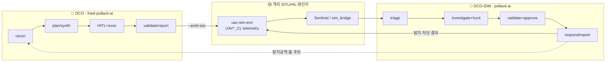

# 🛰️ pollak — UAV 사이버 레인지 & 폐루프 AI 교전 시스템


**pollak** 은 KUS-FS급 MUAV 임무 시스템을 대상으로 **공격 AI ↔ 방어 AI를 하나의
폐루프로 돌리는** UAV 사이버 레인지다. 이 저장소(`pollak-infra`)는 그 레인지를
띄우는 Azure 인프라(IaC)와 평면 사이 이음새를 소유한다.

## 🧠 컨셉 — 왜 폐루프인가

방어를 가정으로 평가하지 않기 위해서다. 공격 에이전트가 킬체인을 실행하면 UAV
텔레메트리(`UAV*_CL`)가 남고, 방어 에이전트는 그 로그를 읽어 탐지·판정·대응한다.
방어가 막은 단계와 놓친 단계가 다음 교전의 입력이 된다. **권투로 치면 실제
스파링** — 이 반복이 지속 교전이다.

핵심은 두 에이전트가 **코드 파이프가 아니라 공유 스키마에서 닫힌다**는 점이다.
방어측은 레드 코드를 import하지 않고 레드가 남긴 `*_CL` 행만 소비한다. 차단·거부된
액션은 애초에 로그를 남기지 않으므로, **방어가 어느 단계에서 킬체인을 끊었는지가
로그의 있고 없음만으로** 확인된다.

LLM은 이 구조에서 중앙 지휘자가 아니다. LangGraph 상태머신·정책 게이트·RAG·
Sentinel 브리지·GitOps 배포면 사이에 놓인, **언제든 교체 가능한 부품**이다.



## 🤖 두 에이전트

| | 🔴 공격 (OCO) | 🔵 방어 (DCO-IDM) |
|---|---|---|
| 저장소 | [fried-pollack-ai](https://github.com/s1ns3nz0/fried-pollack-ai) | [pollack-ai](https://github.com/s1ns3nz0/pollack-ai) |
| 엔진 | LangGraph — recon→plan→HITL→exec→report | 6-에이전트 SOC 그래프 + 3 주기 워커 |
| 규모 | Python 197 모듈·원자 액션 22·무기고 23종·테스트 616 | investigation/report/response + 상관·킬웹·CACAO |
| 통제 | RoE 게이트·HITL·allowlist (모델 밖 결정론) | 정책 하한 + METT-TC 상승·HITL 강제·guardrail |
| 산출 | `UAV*_CL` 행 + SOC Alert | 탐지·차단·RTL·룰 후보 |

## 🚀 실행 방법

### 1. 공격 에이전트 돌리기 ([fried-pollack-ai](https://github.com/s1ns3nz0/fried-pollack-ai))

```bash
python run.py --emit-soc     # 킬체인 실행 + UAV*_CL·SOC Alert 산출
python run.py --hardened     # PoV 페어: 취약 인스턴스 성공 / 하드닝 인스턴스 거부 대조
```

`--emit-soc` 는 관측한 감사 이벤트를 `out/uav_cl_rows.ndjson`(UAV*_CL 행)과
`out/soc_alert.json`으로 내보낸다 — 이게 방어측 입력이다. `--hardened` 는 같은
공격을 서명(MAVLink2)·망분리·링크암호화로 거부해 "무방비 기체는 뚫리고 방비된
기체는 막힌다"를 나란히 보여 준다. **외부 의존 없이 표준 라이브러리만으로 Tier 0
재현**된다.

### 2. 방어 에이전트 돌리기 ([pollack-ai](https://github.com/s1ns3nz0/pollack-ai))

같은 스키마의 텔레메트리를 Azure Sentinel 또는 `sim_bridge`로 읽어 6-에이전트
파이프라인(triage→investigation+hunt→validation+approval→response)을 돈다. LLM
요약은 로컬 Ollama(`qwen2.5`)로 실연동되며 결정론 폴백을 갖춘다. 탐지 룰은
[dah-sentinel-content](https://github.com/s1ns3nz0/dah-sentinel-content)의 165룰
라이브러리에서 온다.

### 3. 인프라 배포 (이 저장소)

레인지를 Azure에 올린다. 이음새를 먼저 한 번 배포한다.

```bash
az deployment sub create --location koreacentral \
  --template-file bicep/shared.bicep --parameters bicep/params/lab-shared.bicepparam
```

세 평면을 미리보기·프로비저닝한다.

```bash
az deployment sub what-if --location koreacentral \
  --template-file bicep/main.bicep --parameters bicep/params/lab.bicepparam

scripts/deploy-red-with-sim.sh    # 멱등 sim(존재 시 건너뜀)+red 프로비저닝
```

**자기 구독에 배포하는 리뷰어 (Path B):** `bicep/params/judge.bicepparam`를 복사해
`REPLACE_*` 토큰을 채우고 `RED_PARAM_FILE`/`SIM_PARAM_FILE`로 스크립트에 물린다.
전체 런북은 red 앱 저장소의 `deploy/JUDGE-DEPLOY.md` 참고.

## 🧩 이 저장소의 역할

세 평면(🔴 red `dah-red-aks` / 🟡 sim `dah-sim-aks` / 🔵 soc `dah-soc-aks`)은 각각
독립된 AKS 클러스터·VNet·리소스 그룹이다. red는 살아있는 공격 도구를 돌리므로,
평면 경계는 **실제 신뢰경계**다. 어느 평면에도 속하지 않는 이음새가 여기 산다.

- red↔sim VNet 피어링 + Azure Firewall 이그레스 허용목록 (공격 경로)
- 공유 Sentinel / Log Analytics 워크스페이스 `dah-data-law` — sim은 append-only로
  쓰고 soc는 읽는다 (탐지 경로, sim↔soc 직접 피어링 **없음**)
- 프라이빗 DNS 존 (`*.pollak.store`) · 평면 경계를 강제하는 RBAC

```
bicep/
  main.bicep · sim.bicep · shared.bicep   # red · sim · 이음새 (subscription 범위)
  modules/ · params/                       # 평면별·이음새 모듈 / lab·judge 파라미터
scripts/deploy-red-with-sim.sh             # 멱등 sim+red 프로비저닝
```

## 🗂️ 저장소 생태계

| 저장소 | 계층 | 담는 것 |
|---|---|---|
| [**pollak-infra**](https://github.com/s1ns3nz0/pollack-infra) | infra | 이 저장소 — 세 평면 Azure IaC + 평면 이음새 |
| [uav-sim-env](https://github.com/s1ns3nz0/uav-sim-env) | sim | KUS-FS급 MUAV SITL 레인지 (ArduPilot·13 컨테이너·19 `UAV*_CL`) |
| [fried-pollack-ai](https://github.com/s1ns3nz0/fried-pollack-ai) | red | OCO 레드팀 에이전트 |
| [pollack-ai](https://github.com/s1ns3nz0/pollack-ai) | soc | DCO-IDM 방어 AI SOC |
| [dah-sentinel-content](https://github.com/s1ns3nz0/dah-sentinel-content) | soc | Sentinel Detection-as-Code — 분석 룰 167개(`S*` 131 + `C*` 34) |

## ✅ 검증 & 정직성 가드

수치는 손으로 적지 않고 커밋된 산출물에서 자동으로 다시 뽑아 검증한다
(`benchmarks/verify_claims.py`, `tests/test_no_phantom_action.py`). CI가
pytest → check_gates → verify_claims → gitleaks를 차단 조건으로 건다. **재현되지
않는 능력은 능력으로 세지 않는다.** 방어 룰은 폭(전술 93.3%·기법 80%·165룰)과
깊이(실 배포 성숙도 3.6%)를 분리해 정직하게 제시한다.

## 🙏 기반 기술

[Kubernetes](https://kubernetes.io/) · [Helm](https://helm.sh/) ·
[kagent (CNCF)](https://kagent.dev/) · [Argo CD](https://argo-cd.readthedocs.io/) ·
[OpenTelemetry](https://opentelemetry.io/) ·
[Microsoft Sentinel](https://learn.microsoft.com/azure/sentinel/) ·
[LangGraph](https://langchain-ai.github.io/langgraph/) ·
[Ollama](https://ollama.com/) · [ArduPilot](https://ardupilot.org/)

## 📮 문의

**s1ns3nz0** · GitHub [@s1ns3nz0](https://github.com/s1ns3nz0) — 버그·제안은 각
저장소의 Issues로.

---

<sub>🌐 EN: **pollak** is a UAV cyber range that runs an offensive AI ↔ defensive
AI closed loop over a KUS-FS-class MUAV mission system. The red agent
(`fried-pollack-ai`) executes kill chains and emits `UAV*_CL` telemetry via
`run.py --emit-soc`; the blue agent (`pollack-ai`) consumes the same schema and
detects/responds. This repo (`pollak-infra`) is the Azure IaC that stands the
range up. Detection content ships from `dah-sentinel-content`.</sub>
