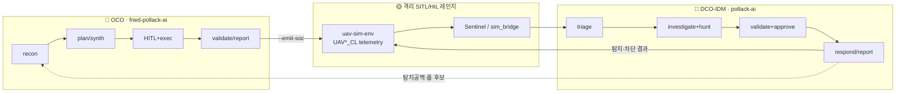
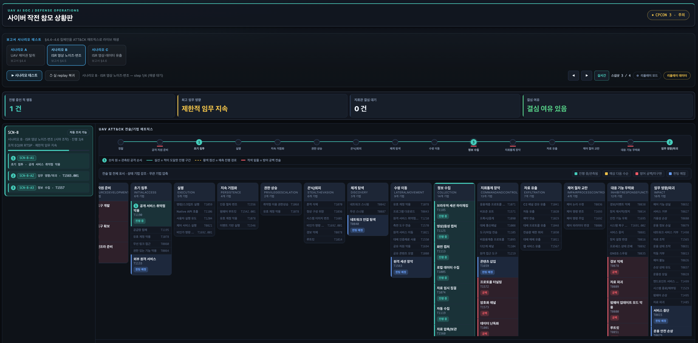
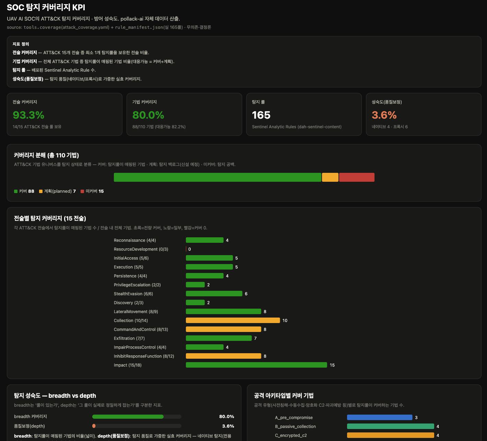

# Pollack: Field manual as Code with AI for UAV

<p align="center">


</p>


**pollack** 은 KUS-FS급 MUAV 임무 시스템을 대상으로 **공격 AI ↔ 방어 AI를 하나의
폐루프로 돌리는** UAV 사이버 레인지다. 이 저장소(`pollack-infra`)는 그 레인지를
띄우는 Azure 인프라(IaC)와 평면 사이 이음새를 소유한다.


## 설계 원칙

설계의 출발점을 모델이 아니라 **조직과 교리**에 두었다. 핵심 원칙은 한 문장이다 —
**"AI는 판단을 돕고, 권한은 코드와 정책이 쥔다."** AI는 참모이고, 방아쇠는 사람과
코드가 쥔다. LLM은 계획 보조·결과 요약·근거 정리처럼 불확실성을 줄이는 일을 맡고,
교전권한·물리 비가역 명령 승인·심각도 하한·정탐 판정·대응 실행 여부처럼 임무 안전과
법적 책임이 걸린 결정은 **결정론 모듈과 HITL 게이트**가 처리한다.

미군 기준을 빌린 건 권위 차용이 아니라 이미 검증된 절차서를 재사용한 것이다. 작전
논리는 미군 교리(JP·CJCSI·DoDD)에서, 사고대응·증거·통제 원칙은 NIST(SP 800-53·
800-61·800-184·800-160v2·OSCAL·AI RMF)에서, 실행 자동화는 CNCF 클라우드 네이티브
스택과 LangGraph에서 가져왔다.

**조직 분리가 첫 설계 결정.** USCYBERCOM 사이버임무군(CMF)은 공세 전력(OCO —
NMT·CNMF·CMT)과 방어 전력(DCO-IDM — CPT)을 애초에 나눈다. 이 공수 분리를 그대로
가져와 공격 `fried-pollack-ai`와 방어 `pollack-ai`를 별도 저장소·별도 런타임으로
쪼갰다. 방어측은 레드 코드를 import하지 않고 두 에이전트는 UAV*_CL 텔레메트리
스키마로만 만난다 — 공격자가 방어측 답안지를 커닝해 회피에 최적화되는 경로를 원천
차단한다.

### Field Manual as Code 매핑

| 교범·조직 근거 | 코드 구현 |
|---|---|
| JP 3-12 · OCO/DCO/DODIN 분리 | 저장소 분리, UAV*_CL one-way 브릿지 |
| JP 3-60 · 표적화(CARVER·HPTL) | red `planner`, `targeting/carver.py`·`prioritize.py` |
| F3EAD 순환 | red 그래프 노드 순서(recon→…→reporter) |
| SROE·CDE·PID·JCEOI | `checker`·`broker`·`roe_gate.py`·`engagement/gate.py` |
| DoDD 3000.09 · 인간판단·중지 | HITL interrupt, 단발 토큰, out-of-band 검증 |
| CPT · Detect~Assess 순환 | blue 6-에이전트 SOC 그래프 |

### 설계 보고서 요약

1. **공격 시나리오 설계** — `uav-sim-env` 자산을 xT-STRIDE로 위협 모델링하고 ATT&CK for UAV로 정규화해, 직교하는 3대 시나리오(제어권 탈취·영상 변조·데이터 유출)를 뽑는다.
2. **방어 아키텍처** — 탐지룰·Golden Fixture·Runbook·CACAO Playbook을 전술판 기준으로 미리 엮은 **사전 정의 계약**, D3FEND 매핑, 다층 방어, 공격 이후 임무 지속성(**Mission Assurance**)까지 세운다.
3. **AI 에이전트 설계** — 두 에이전트를 LangGraph 상태머신으로 구현하고, 권한(교전·승인·판정·배포)은 RoE·HITL·오라클로 **모델 밖**에 두며, RAG는 조사 보강에만 쓴다.
4. **결론·향후 계획** — 폐루프 적대 검증·결정론 권한 경계·Tier 0 재현성이 핵심 기여이고, 미커버 기법 실 배포와 Azure 라이브 배선이 다음 단계다.
5. **참고문헌** — 미군 교리(JP·CJCSI·DoDD)·NIST·MITRE·OASIS·학술(xT-STRIDE)에 근거를 둔다.

### AI 엔지니어링 계층

임무 절차를 **타입이 정해진 상태머신**으로 만들고 그 안에 LLM을 제한된 부품으로
배치한다. 공정 라인처럼 각 계층이 한 가지 안전 역할만 맡는다.

| 계층 | 목적 | 구현 요소 |
|---|---|---|
| **Agent workflow** | 교리 절차를 상태 전이로 고정 | LangGraph, `SOCState`, red/blue 그래프 빌더 |
| **Tool boundary** | LLM의 직접 위험행위 차단 | FastMCP, kagent, coarse-grained MCP, allowlist |
| **Knowledge grounding** | 근거 검색은 허용, 판정권은 불허 | RAGFlow, 로컬 GraphRAG, `RetrievedChunk` |
| **Decision control** | 안전·법적 결정을 모델 밖으로 | `SeverityEngine`, signal judge, HITL, CACAO/런북 |
| **Evaluation & Ops** | 재현성·관측성·배포 무결성 | golden fixture, OpenTelemetry, Argo CD drift |

LLM은 다섯 계층 어디에서도 최종 권한을 갖지 않는다. `core/llm.py`의 `LLMClient`
프로토콜 뒤에 있으며, 현재 Ollama `qwen2.5`이고 Azure OpenAI(GPT-4o)는 같은
프로토콜을 구현하는 교체 지점으로 남겨 뒀다. **모델을 바꿔도 상태·정책·게이트
경계는 그대로다** — "모델은 교체 가능한 부품"의 실제 의미다.

### 폐루프 교전 구조

두 에이전트는 **코드 파이프가 아니라 공유 스키마에서 닫힌다.** 공격이 킬체인을
실행하면 UAV*_CL 텔레메트리가 남고, 방어는 그 로그를 읽어 탐지·판정·대응하며,
막은 단계와 놓친 단계가 다음 교전의 입력이 된다(권투의 실제 스파링). 차단·거부된
액션은 로그를 남기지 않으므로 **방어가 어느 단계에서 킬체인을 끊었는지가 로그의
있고 없음만으로** 확인된다.



## 공격·방어 에이전트

| | 🔴 공격 (OCO) | 🔵 방어 (DCO-IDM) |
|---|---|---|
| 저장소 | [fried-pollack-ai](https://github.com/s1ns3nz0/fried-pollack-ai) | [pollack-ai](https://github.com/s1ns3nz0/pollack-ai) |
| 엔진 | LangGraph — recon→plan→HITL→exec→report | 6-에이전트 SOC 그래프 + 3 주기 워커 |
| 규모 | Python 197 모듈·원자 액션 22·무기고 23종·테스트 616 | investigation/report/response + 상관·킬웹·CACAO |
| 통제 | RoE 게이트·HITL·allowlist (모델 밖 결정론) | 정책 하한 + METT-TC 상승·HITL 강제·guardrail |
| 산출 | `UAV*_CL` 행 + SOC Alert | 탐지·차단·RTL·룰 후보 |

## SOC 탐지 커버리지

| 지표 | 값 |
|---|---|
| ATT&CK 전술 커버리지 | **93.3%** (15전술 중 14) |
| 기법 커버리지 | **80.0%** (110기법 중 88) |
| 탐지 룰 | **165** (`dah-sentinel-content`) |
| 무기고 커버(공격) | **100%** (23/23) |

## 저장소 구성

| 저장소 | 계층 | 담는 것 |
|---|---|---|
| [**pollack-infra**](https://github.com/s1ns3nz0/pollack-infra) | infra | 이 저장소 — 세 평면 Azure IaC + 평면 이음새 |
| [uav-sim-env](https://github.com/s1ns3nz0/uav-sim-env) | sim | KUS-FS급 MUAV SITL 레인지 (ArduPilot·13 컨테이너·19 `UAV*_CL`) |
| [fried-pollack-ai](https://github.com/s1ns3nz0/fried-pollack-ai) | red | OCO 레드팀 에이전트 |
| [pollack-ai](https://github.com/s1ns3nz0/pollack-ai) | soc | DCO-IDM 방어 AI SOC |
| [dah-sentinel-content](https://github.com/s1ns3nz0/dah-sentinel-content) | soc | Sentinel Detection-as-Code — 분석 룰 167개(`S*` 131 + `C*` 34) |

## 설계 보고서

| # | 제목 | 요약 |
|---|---|---|
| **1** | 공격 시나리오 설계 | `uav-sim-env` 자산을 xT-STRIDE로 위협 모델링하고 MITRE ATT&CK for UAV(15전술·116기법)로 정규화. 직교하는 3대 시나리오 확정 — **A** 제어권 탈취 · **B** ISR 영상 변조 · **C** ISR 데이터 유출. |
| **2** | 방어 아키텍처 | 탐지룰·Golden Fixture·Runbook·CACAO Playbook을 전술판 기준으로 미리 엮은 **사전 정의 계약** + D3FEND 방어 매핑 + 다층 방어. 공격 이후 임무 지속성을 판정하는 **Mission Assurance**. |
| **3** | AI 에이전트 설계 | 두 에이전트를 LangGraph 상태머신으로 구현. **Field Manual as Code** — 미군 교리를 저장소 경계·그래프 순서·승인 게이트로 사상. RoE·단발 HITL 토큰·out-of-band 오라클로 권한을 모델 밖에, RAG는 조사 보강만. AI Engineering **다섯 계층**. |
| **4** | 결론 및 향후 계획 | 핵심 기여 — **폐루프 적대 검증**(defend forward)·**결정론 권한 경계 + HITL**·**Tier 0 재현성**. 향후 — 미커버·계획 기법을 실 배포로 커버 확대, Azure 라이브 배선(OpenAI·AKS CronJob·Sentinel 라이브 경로). |
| **5** | 참고문헌 | 미군 교리(JP·CJCSI·DoDD) · 표준(NIST·OASIS·OWASP) · 위협지식(MITRE ATT&CK/ATLAS/D3FEND·CISA) · 학술(xT-STRIDE) · 기술 스택 출처. |

## 시각 자료

### 사이버 작전 참모 상황판



### SOC 탐지 커버리지 KPI 대시보드



## 데모 실행

시간과 Azure 권한에 따라 두 경로 중 하나를 선택합니다.

| 구분 | 짧은 로컬 데모 | Azure 풀 배포 |
|---|---|---|
| 실행 | `python demo.py` + `python run.py --emit-soc` | `bash scripts/deploy-judge-demo.sh` |
| 비용 | Azure 비용 없음 | AKS·Firewall·Log Analytics·Sentinel·AOAI 등 과금 |
| 모델 | 호스팅 모델 불필요 | Azure OpenAI `gpt-4o-mini` 사용 |
| 통제 | 결정론 Gate·HITL·ground truth | 동일한 결정론 Gate·HITL이 최종 권한 유지 |

### 짧은 데모

```bash
git clone https://github.com/s1ns3nz0/fried-pollack-ai.git
cd fried-pollack-ai
python -m venv .venv && source .venv/bin/activate
pip install -r requirements.txt
python demo.py
python run.py --emit-soc
python -m redteam_core.kpi.dashboard
```

### Azure 풀 배포

```bash
git clone https://github.com/s1ns3nz0/pollack-infra.git
git clone https://github.com/s1ns3nz0/fried-pollack-ai.git
cd pollack-infra
bash scripts/deploy-judge-demo.sh
```

배포가 끝나면 **스크립트가 출력한 결과의 주소를 우선 사용하세요.** 기본 로컬
포트포워딩 주소는 다음과 같습니다.

| 대시보드 | 기본 주소 |
|---|---|
| KPI Dashboard | `http://localhost:18082/kpi-dashboard.html` |
| kagent UI | `http://localhost:18080` |
| Argo CD (설치 시) | `https://localhost:18081` |

Azure 리소스의 Portal 링크와 실제 포트는 배포 환경에 따라 달라질 수 있으므로,
풀 배포 후 터미널에 표시된 스크립트 결과를 확인하세요.

> 풀 배포는 실제 Azure 과금 리소스를 생성합니다. 데모 후 리소스 그룹을
> 수동 삭제하고, 상세 절차는 `fried-pollack-ai/deploy/JUDGE-DEPLOY.md`를 확인하세요.

## 기반 기술

[Kubernetes](https://kubernetes.io/) · [Helm](https://helm.sh/) ·
[kagent (CNCF)](https://kagent.dev/) · [Argo CD](https://argo-cd.readthedocs.io/) ·
[OpenTelemetry](https://opentelemetry.io/) ·
[Microsoft Sentinel](https://learn.microsoft.com/azure/sentinel/) ·
[LangGraph](https://langchain-ai.github.io/langgraph/) ·
[Ollama](https://ollama.com/) · [ArduPilot](https://ardupilot.org/)

## 문의

**s1ns3nz0** · GitHub [@s1ns3nz0](https://github.com/s1ns3nz0) — 버그·제안은 각
저장소의 Issues로.
