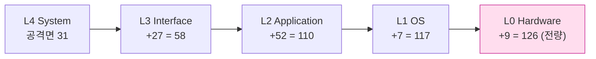
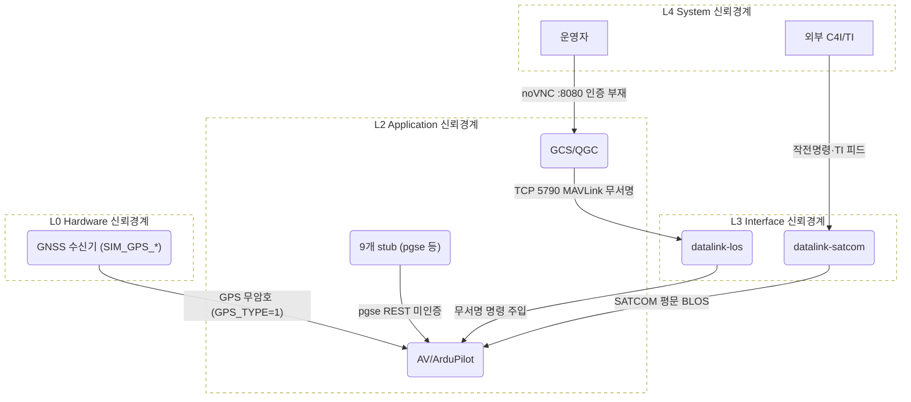
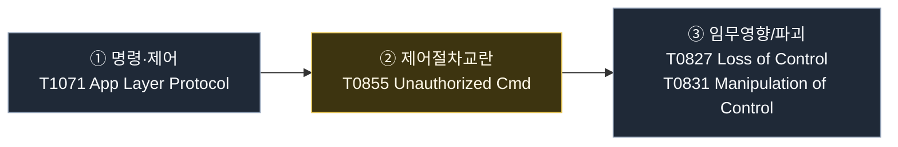
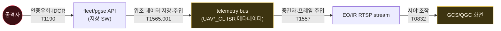
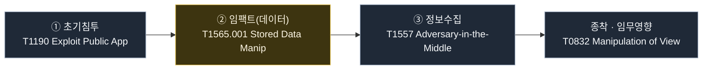
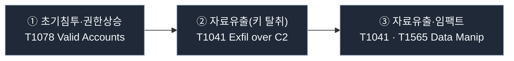

# 2. 방산 분야 공격 시나리오 설계

## 2.1 자산 범위 확정: `uav-sim-env`

이 장의 순서는 의도적으로 고정한다. 먼저 공격 대상 자산의 경계를 확정하고, 그 경계 위에서 xT-STRIDE 위협 모델링을 수행한다. 그 다음 모델링 결과를 MITRE ATT&CK for UAV 전술·기법 매트릭스로 정규화하고, 마지막으로 그 매트릭스를 대표 공격 흐름에 반영한다. 순서를 바꾸면 공격 흐름이 자산에서 도출된 것인지, 사후적으로 자산을 끼워 맞춘 것인지가 불분명해진다.

대상은 추상적 UAV가 아니라 격리 시뮬레이션 환경 [`uav-sim-env`](https://github.com/s1ns3nz0/uav-sim-env)다. KUS-FS급 MUAV(LIG Nex1 MPD 페르소나)를 ArduPilot SITL로 돌리고, 데이터링크·GCS·PGSE·MPS·C4I·무장·인증 등 13개 컨테이너로 임무 시스템 전체를 모사한다. 모든 트래픽은 19종 `UAV*_CL` 로그 테이블로 관측된다.

자산 범위는 네 묶음으로 잡는다. 통신, 컴퓨팅·애플리케이션, 센서, 사이버 페르소나다. 이 네 묶음이 뒤의 xT-STRIDE 신뢰레벨과 MITRE 전술판의 입력이 된다.

| 컴포넌트 | uav-sim-env 자산 | 핵심 취약 전제 |
|---|---|---|
| 통신(L3) | datalink-los TCP 5790·datalink-satcom | MAVLink 무서명, SATCOM 평문 |
| 컴퓨팅·애플리케이션(L2) | ArduPilot FCC·QGC·9개 stub·AI 에이전트 | `ARMING_CHECK=0`, 미인증 REST(pgse `/launch/authorize`) |
| 센서(L0) | GPS(`GPS_TYPE=1`)·INS·EO/IR·SAR | GNSS 무암호, 위조 신호 무검증 수용 |
| 사이버 페르소나(L4) | GCS 자격·auth-stub | 약한 자격·MFA 미적용 |

여기서 확정한 자산 범위는 이후 절의 입력이 된다. 2.2절은 이 자산을 xT-STRIDE로 위협 모델링하고, 2.3절은 그 결과를 MITRE ATT&CK for UAV로 확정한다. 2.4~2.6절의 대표 공격 흐름은 이 순서의 마지막 산출물이다.

## 2.2 xT-STRIDE 위협 모델링과 공격표면 확정

분석 대상을 기체 한 대가 아니라 시스템 전체로 설정하는 이유는 무인기 체계의 공격표면이 소비자용 드론과 근본적으로 다르기 때문이다. 공격 대상은 기체 자체가 아니라, 그 기체를 운용·통제하고 정보를 수집하는 지상 계통 전체다. 지상통제소(GCS), C2 데이터링크, 군집 조정 평면, ISR 수집·저장 계통, 그리고 이 전체를 배포하는 CI/CD 공급망까지가 하나의 임무 시스템으로 묶인다. 어느 평면이 외부 입력을 받고 어느 신뢰경계가 다음 자산으로 이어지는지를 먼저 식별해야 공격의 성패를 판단할 수 있다.

위협면은 두 관점을 겹쳐 본다. JP 3-12의 3계층(물리·논리·페르소나)은 사이버 작전 계층 관점이고, 2.1절에서 확정한 자산 범위를 xT-STRIDE 5 신뢰레벨(L4 System→L0 Hardware)로 다시 나누는 것이 계산적 신뢰 관점이다. 아래 표는 UAV 임무 시스템을 다섯 평면으로 나누되, 각 평면을 두 관점 모두에 정렬한다. xT-STRIDE 신뢰레벨은 "위협이 실현되는 자산 계층"(홈레벨) 기준이며, 진입 경로와 다를 수 있다.

| 평면 | JP 3-12 계층 | xT-STRIDE 신뢰레벨(홈) | 대표 자산 | 핵심 취약 전제 |
|---|---|---|---|---|
| C2 링크 | 물리·논리 | L3 Interface (RF 물리는 L0) | GCS↔기체 MAVLink2·datalink-los 5790 | 메시지 서명 미적용·세션키 노출 |
| 군집 조정 | 논리 | L3 Interface | flocking 규칙·리더 선출·스웜 명령 | 노드 상호인증·명령 재생방지 부재 |
| 지상 SW | 논리 | L2 Application (외부 함대 API는 L4) | 함대관리 API·텔레메트리 버스·QGC·stub | 인증우회(IDOR)·무결성 검증 부재 |
| ISR 수집 | 논리 | L2 Application (EO/IR·SAR 센서는 L0) | EO/IR·RTSP·SAR 좌표·암호키 | 스트림 미암호·저장소 접근제어 미흡 |
| 사이버 페르소나 | 페르소나 | L4 System | GCS 운용자 계정·자격증명·auth-stub | 약한 자격·MFA 미적용 |

두 관점은 서로를 보강한다. JP 3-12 계층이 "작전상 어느 영역인가"를 말하면, xT-STRIDE 신뢰레벨은 "그 위협을 완화하려면 어느 계산 계층까지 신뢰를 내려 전개해야 하는가"를 말한다. 예컨대 C2 링크는 작전상 물리·논리 계층이지만, 완화 관점에서는 통신 인터페이스(L3)와 RF 프런트엔드(L0)를 함께 봐야 한다. 2.1절에서 KUS-FS의 기밀급 요구에 따라 L0까지 전개한 것이 이 표의 신뢰레벨 열에 그대로 반영된다.

여기서 이 장 전체를 관통하는 설계 기준이 도출된다. 대표 공격 경로는 서로 다른 종착 임무(제어권·시야·데이터)와 서로 다른 평면(C2 링크·텔레메트리/ISR·자격)을 대상으로 선정했다. 이를 통해 세 시나리오는 동일 취약점의 반복이 아니라, UAV 임무 시스템의 서로 다른 신뢰경계를 관통하는 공격 계획으로 구성된다.

### xT-STRIDE 위협 모델링: 공격표면 식별 방법

이 절은 자산을 채점한 평가 결과가 아니라, 공격표면을 식별하고 "어떤 공격이 어디서 가능한가"를 도출한 **방법의 기록**이다. 자산 구분은 임의적 판단에 의존하지 않았다. UAV 보안 전용 위협 모델링 방법론인 **xT-STRIDE**를 `uav-sim-env`에 적용해 자산 범위를 확정하고, 신뢰경계마다 STRIDE를 적용해 가능한 공격을 열거했다. 그 산출이 2.3절의 MITRE ATT&CK for UAV 매트릭스를 확정하는 입력이 되었다.

xT-STRIDE의 핵심은 STRIDE 6범주에 Common Criteria 기반 **계산적 신뢰계층**을 결합한 것이다. UAV를 System(L4)→Interface(L3)→Application(L2)→OS(L1)→Hardware(L0) 5개 신뢰레벨로 나누고, 신뢰레벨 T를 선택하면 T 미만 계층은 "이미 신뢰된 것"으로 간주해 분석 범위에서 뺀다. 그래서 신뢰레벨을 System 쪽으로 높게 잡을수록 분석에 들어오는 공격면은 좁고, Hardware 쪽으로 낮게 잡을수록 넓어진다. 즉 신뢰레벨 선택이 곧 "어디까지를 공격 가능한 표면으로 볼 것인가"를 정한다.

KUS-FS에 적용할 신뢰레벨은 사실상 결정되어 있다. 군용 목적 시스템은 전 레벨을 분석하라는 방법론 규칙과, KUS-FS가 다루는 임무계획·EO/IR·SAR가 기밀급 이상이라는 데이터 분류가 레벨 선택을 규정한다. L0(하드웨어)까지 전부 전개한다. 아래 도식은 신뢰레벨을 낮게 선택할수록 분석 대상 공격면이 어떻게 누적되는지를 보인다.

가능한 공격 126건(S1~S126)을 각각 "공격이 실현되는 자산 계층"(홈레벨)에 정확히 하나씩 배정하면 L0=9, L1=7, L2=52, L3=27, L4=31이 된다. L4에서 시작해 아래로 내려갈수록 31→58→110→117→126으로 단조 증가한다. KUS-FS가 L0을 선택했다는 것은 곧 가능한 공격 126건 전량을 공격 흐름 도출의 원천으로 삼았다는 뜻이다.

### 계층별 공격 가능성 분포: STRIDE × 신뢰레벨 히트맵

각 공격의 예상 ATT&CK 전술을 STRIDE로 역매핑해(한 공격이 여러 STRIDE 태그를 가질 수 있다) 신뢰레벨별로 집계하면 공격면 지형이 한눈에 드러난다. 셀 값은 태그 인스턴스 수다.

| STRIDE | L0 (HW) | L1 (OS) | L2 (App) | L3 (Iface) | L4 (Sys) | 행 합계 |
|---|---|---|---|---|---|---|
| S 인증성 | 2 | 2 | 4 | 7 | 17 | 32 |
| T 무결성 | 8 | 3 | 40 | 12 | 8 | 71 |
| R 부인방지 | 0 | 2 | 2 | 3 | 5 | 12 |
| I 기밀성 | 0 | 0 | 6 | 9 | 3 | 18 |
| D 가용성 | 8 | 1 | 40 | 15 | 9 | 73 |
| E 인가 | 1 | 4 | 3 | 4 | 17 | 29 |
| **열 합계** | **19** | **12** | **95** | **50** | **59** | **235** |

행 합계와 열 합계가 235로 일치해 산출의 내적 정합성이 확인된다. 이 분포는 세 가지를 시사한다. L2(Application)가 95개 태그로 가장 넓은 위협 표면인데, ArduPilot·QGC·9개 stub·AI 에이전트가 모두 이 계층에 몰려 있기 때문이다. L0(Hardware)은 T·D(센서 스푸핑) 쌍이 지배적이어서, 하드웨어를 신뢰하지 않는 한 물리 계층까지 전개해야 함을 보여준다. L4(System)로 갈수록 위협이 공급망 신원위장(S)·권한상승(E)으로 수렴한다. 대표 공격 경로가 각각 L3·L2·L4에서 실현되는 것도 이 지형 위의 좌표다.

### 공격표면 진입점: 데이터흐름도(DFD)

아래 DFD는 `uav-sim-env`의 신뢰경계를 STRIDE-GPT의 DFD 스키마로 그린 것이다. 점선은 신뢰경계(subgraph), 화살표 위 라벨은 신뢰경계를 넘는 취약 흐름, 곧 공격 진입점이다.

신뢰경계를 교차하는 흐름 다섯이 공격 진입점이다. GCS→LOS(TCP 5790 무서명), EXT→SATCOM→AV(평문 BLOS), GNSS→AV(무암호), STUB→AV(미인증 REST), OP→GCS(noVNC 인증 부재). 후속 대표 경로는 이 진입점 중 5790 데이터링크, pgse/텔레메트리, GCS 자격 경로를 활용한다.

## 2.3 MITRE ATT&CK for UAV 확정

여기까지가 xT-STRIDE의 역할이다. 자산 범위를 신뢰레벨로 확정하고(공격면 도식), 어느 계층에 어떤 공격이 가능한지 집계하고(히트맵), 그 공격이 실제로 어디로 들어오는지 진입점을 짚었다(DFD). 세 결과가 함께 "이 시스템에서 어떤 공격이 가능한가"를 확정한다.

이렇게 도출한 가능한 공격들을 전술·기법 어휘로 정규화한 것이 **MITRE ATT&CK for UAV 매트릭스(15 전술·116 기법)**다. MITRE는 UAV 전용 ATT&CK 매트릭스를 공식 발간하지 않았다. 따라서 본 보고서의 ATT&CK for UAV는 ATT&CK Enterprise(IT 성격 자산), ATT&CK for ICS(비행제어·MAVLink 물리 평면), MITRE ATLAS(적대적 ML), UAV 위협 연구를 `uav-sim-env` 자산에 투영한 자체 매트릭스다.

| 항목 | 값 |
|---|---:|
| 총 전술 | 15 |
| 총 기법 | 116 |
| 커버(공격 가능) | 113 (97.4%) |
| 범위 제외 | 3개(Resource Development) |

투영 규칙은 명확하다. 함대관리 API·GCS 계정·저장소·C2 채널은 Enterprise 전술·기법으로 매핑한다. ArduPilot/PX4와 MAVLink 명령 평면은 물리 프로세스를 지휘하는 사이버-물리 제어계이므로 ATT&CK for ICS로 매핑한다. 무허가 비행 명령을 Enterprise의 실행(Execution)이 아니라 ICS의 공정제어저해(Impair Process Control, T0855)로 잡는 이유가 여기에 있다. 온보드 자율비행 AI를 겨냥한 회피·프롬프트 인젝션은 ATLAS로 분리한다.

STRIDE 태그는 ATT&CK 전술로 역매핑했다. 인증성(S)·인가(E)는 초기침투·자격접근·권한상승으로, 무결성(T)·가용성(D)은 공정제어저해·데이터조작·임팩트로, 기밀성(I)은 수집·유출로 옮겼다. 그 뒤 실제 `uav-sim-env` 자산에서 실행 가능한 기법만 매트릭스에 남겼다. 그래서 이 매트릭스는 일반 UAV 보안 체크리스트가 아니라 본 레인지의 공격표면을 반영한 전술판이다.

아래 표는 15개 전술과 각 전술의 기법을 ATT&CK ID로 정리한 것이다. 기법 총수는 116개이고, Resource Development 3개는 본 레인지의 직접 공격 범위 밖이라 나머지 113개가 공격 가능 커버리지에 들어간다. `커버` 열은 (범위내 공격 가능 기법)/(전체 기법)이다.

| 전술 | 커버 | 기법 (ATT&CK ID) |
|---|---|---|
| 정찰 Reconnaissance | 4/4 | T1595·T1592·T1590·T1596 |
| 자원개발 Resource Dev | 0/3 | T1587·T1588·T1608 (범위 제외) |
| 초기침투 Initial Access | 7/7 | T1190·T1133·T1195·T1078·T0860·T0864·T1195.002 |
| 실행 Execution | 6/6 | T1059·T1106·T1204·T0821·T1692.001·T1203 |
| 지속 Persistence | 5/5 | T1556·T1542.001·T0859·T1546·T0857 |
| 권한상승 Privilege Escalation | 2/2 | T1068·T1078.pe |
| 은폐/회피 Stealth/Evasion | 7/7 | T1070·T1036·T1601·T1014·T0878·T1600·T1553 |
| 발견 Discovery | 3/3 | T0840·T0842·T0887 |
| 측면이동 Lateral Movement | 11/11 | T0843·T1210·T1563·T1570·T1021·T1550·T1694·T1080·T1552·T1555·T1649 |
| 수집 Collection | 10/10 | T1557·T1125·T1119·T0845·T1113·T1185·T1005·T1056·T1074·T1560 |
| 명령·제어 Command and Control | 14/14 | T1071·T1571·T1090·T1008·T1659·T1105·T1095·T1572·T1104·T1573·T1219·T1001·T1132·T1090.002 |
| 유출 Exfiltration | 7/7 | T1041·T1011·T1020·T1029·T1048·T1030·T1567 |
| 공정제어저해 Impair Process Control | 6/6 | T0836·T1693·T1692·T0806·T0855·T0856 |
| 대응저해 Inhibit Response | 11/11 | T0838·T0814·T1695·T1691.002·T0881·T0816·T0892·T0835·T0809·T0800·T0851 |
| 임팩트 Impact | 20/20 | T0832·T0882·T0827·T0880·T0879·T1498·T1565·T0815·T0831·T0813·T0829·T0826·T0837·T0828·T1499·T1529·T1495·T1485·T1531·T1565.001 |

이 전술판에서 중요한 것은 총 116기법 중 113기법이 레인지 안에서 공격 가능하다는 점이다. 제외 3개는 Resource Development다. 레인지 외부에서 능력을 개발·구매·스테이징하는 준비 단계라서 `uav-sim-env` 내부 공격 가능 범위에서는 제외했다.

이 전술판은 이후 절의 조합 기준이다. 즉 자산에서 나온 위협을 먼저 15전술·116기법으로 정규화하고, 그 전술·기법을 조합해 공격 흐름을 구성한다.

### 시나리오 반영 기준

위협면에서 가능한 공격은 다수이지만, 대표 공격 흐름 설계에는 적절히 선정한 세 개로 충분하다. 세 개를 선정한 기준은 네 가지이며, 세 시나리오는 그 기준을 동시에 만족하는 조합이다. 임의로 추출한 표본이 아니라, 계층·효과·취약 전제·재현성을 동시에 대표하도록 선정한 조합이다.

첫째, JP 3-12 3계층을 하나씩 관통하도록 골랐다. A는 물리·논리 계층(C2 링크), B는 논리 계층(텔레메트리·수집), C는 사이버 페르소나 계층(자격)을 겨냥한다. 세 계층을 각각 대표하는 시나리오를 두면 공격 흐름이 특정 계층 하나에 치우치지 않는다.

둘째, 종착 효과가 서로 겹치지 않게 골랐다. 정찰 무인기를 무력화하는 임무 효과는 크게 세 가지다. 조종권 탈취(제어), 운용자 인지 교란(시야), 수집 정보의 반출(데이터)이다. A·B·C가 각각 ATT&CK 임팩트의 이 세 축(Manipulation of Control·Manipulation of View·Exfiltration)을 대표한다.

셋째, 같은 종류의 약점을 반복하지 않게 했다. A는 링크 신뢰 문제, B는 데이터·영상 무결성 문제, C는 자격과 자료 접근통제 문제를 대표한다. 세 경로가 서로 다른 평면을 지나야 후속 방어 설계에서도 링크 보강, 데이터 무결성 보강, 자격·유출 통제를 분리해 설계할 수 있다.

넷째, 실현 가능하고 대표성 있는 킬체인만 골랐다. 세 시나리오는 각각 문서화된 실제 UAV 공격 계보 위에 서 있다. GPS·링크 스푸핑을 통한 제어 탈취, 영상 스트림 주입을 통한 상황인식 오염, GCS 자격 탈취를 통한 정찰 데이터 유출이다. 2.2절에 명시한 전제(서명 미적용·미암호·약한 자격) 아래서 격리 레인지에서 재현 가능하다. 이론상 가능하지만 재현 불가능한 공격은 대표 흐름에서 제외했다.

네 기준을 함께 놓으면, 세 시나리오는 계층·효과·취약 전제·재현성의 네 축에서 서로 직교한다. 이 직교성이 세 개만으로도 공격 시나리오 설계의 대표성을 확보하는 이유다.

## 2.4 시나리오 A · UAV 제어권 탈취

**임무**: 기체를 파괴하지 않고 비행 제어권만 원격으로 탈취한다. 실속·추락 없이 조종권 장악 시점에서 정지한다. 파괴는 탐지 가능한 흔적을 남기지만, 은밀하게 획득한 제어권은 그 자체로 공격 수단이 된다.

**공격표면**: C2 링크 평면(물리·논리 계층). GCS와 기체를 잇는 데이터링크에 도달할 수 있고, MAVLink2 메시지 서명이 걸려 있지 않거나 세션키가 노출된 상태를 전제한다.

**공격 성공 조건**: `datalink-los`가 TCP 5790으로 MAVLink 라우팅을 열고, 메시지 서명 또는 송신자 인증이 강제되지 않아야 한다. GCS와 `av-mpd` 사이의 `HEARTBEAT`, 모드 전환, 명령 ACK 흐름이 네트워크에 평문 또는 재사용 가능한 형태로 흘러야 한다. 또한 `av-mpd`가 외부 명령의 출처를 암호학적으로 검증하지 않고, 현재 제어 주체가 누구인지에 대한 세션 소유권을 별도로 고정하지 않는 상태여야 한다. 이 조건이 맞으면 공격자는 별도의 기체 침투 없이 데이터링크 신뢰경계만 넘어 비행제어 평면에 영향을 줄 수 있다.

**익스플로잇 경로**: 공격자는 먼저 링크의 애플리케이션 세션을 식별한다. 핵심은 기체 식별자(`sysid`)와 컴포넌트 식별자(`compid`)를 맞추고, 정상 GCS가 보내는 제어 메시지의 시간 간격과 시퀀스를 모방하는 것이다. 이후 `datalink-los`를 경유해 `av-mpd`가 수용하는 제어 메시지를 주입한다. 이때 취약점은 버퍼 오버플로가 아니라 프로토콜 신뢰 문제다. 링크가 "누가 보냈는가"보다 "형식이 맞는가"를 우선하기 때문에, 형식이 맞는 무허가 명령이 비행제어 평면까지 도달한다.

자산 기준으로 보면 공격자는 세 신뢰경계를 차례로 지난다. 첫째, 외부 네트워크에서 `datalink-los` 인터페이스로 들어오며 L3 Interface 경계를 넘는다. 둘째, MAVLink 라우터가 명령의 발신 주체를 강하게 검증하지 못하면 L2 Application 경계의 `av-mpd`까지 메시지가 전달된다. 셋째, `av-mpd`가 명령을 정상 제어 입력으로 처리하면 비행 모드와 제어권 상태가 바뀐다. 즉 공격 성공은 운영체제 권한 탈취나 펌웨어 변조가 아니라, 인터페이스 신뢰경계의 약점이 애플리케이션 제어 상태로 전이되는 데서 나온다.

이 흐름에서 공격자가 맞춰야 하는 기술 조건도 분명하다. `HEARTBEAT` 송신자, GCS 명령 주기, 모드 전환 ACK 흐름이 정상 프로토콜처럼 보이도록 맞춰야 한다. 단순히 패킷을 보내는 것만으로는 부족하고, "누가 어떤 상태에서 어떤 명령을 냈는가"라는 명령 시퀀스의 형식까지 맞아야 제어 평면에 도달한다.

기술적으로 종착점은 비행 모드와 제어권 상태다. 공격은 무리한 파괴 명령이 아니라 GUIDED 계열 모드 전환과 제어권 전환을 목표로 한다. `av-mpd`가 명령을 정상 ACK하고, GCS 관점에서 조종권 상실 또는 모드 불일치가 발생하면 공격은 성공으로 판정된다. 이 시나리오에서 기체 파괴는 목표가 아니다.

**F3EAD 대응**: Find(링크 도달) → Fix(세션 하이재킹) → Finish(제어권 전환).

**자산 순회 지도**. 공격자가 `uav-sim-env` 자산을 순회하는 경로를 나타낸다. 데이터링크 컨테이너를 발판으로 비행제어 컴퓨터까지 접근한다. 화살표 라벨은 각 경계를 넘을 때 사용하는 기법이다.

| 단계 | 공격 행동 | ATT&CK 전술 | 기법 |
|---|---|---|---|
| ① | C2 애플리케이션 프로토콜 세션을 하이재킹해 통제 채널 장악 | C2 | T1071 Application Layer Protocol |
| ② | 무허가 명령으로 비행 모드를 GUIDED로 강제, 통제 전환 | 공정제어저해 | T0855 Unauthorized Command Message |
| ③ | 제어 권한을 운용자에서 공격자로 전환 | 임팩트 | T0827 Loss of Control · T0831 Manipulation of Control |

공격자는 먼저 C2 데이터링크의 애플리케이션 계층 세션에 끼어들어 통제 채널을 가로챈다(①). 메시지 서명이 없거나 세션키가 새어 나온 링크는 공격자의 명령을 정규 명령과 구분하지 못한다. 채널을 장악하면 곧바로 무허가 명령을 흘려보내 비행 모드를 GUIDED로 강제한다(②). 마지막으로 제어 권한이 운용자에서 공격자에게 이전된다(③). 이 시점에서 공격은 종료된다. 기체는 비행을 유지하지만 조종권은 공격자에게 이전된 상태다.

아래는 이 킬체인을 UAV ATT&CK 매트릭스 위에 옮긴 것이다. C2 장악이 공정제어저해를 거쳐 제어권 상실로 이어지는 순서를 표시한다.

② 무허가 명령(T0855)이 핵심 관통 지점이다. 링크 계층에서 정상 명령과 구분되지 않으면 제어권 전환까지 이어진다.

**종착 효과**: 운용자 조종권 상실과 공격자 기동 장악. 기체는 비행을 유지하고 파괴는 없다.

대응 설계는 3.4절에서 다룬다.

## 2.5 시나리오 B · ISR 영상 노이즈·변조

**임무**: 운용자가 보는 EO/IR·ISR 영상에 노이즈와 위조 프레임을 주입해 상황인식을 오염시킨다. 기체 제어는 건드리지 않는다. 기체는 정상적으로 비행하고 명령을 정상 수행하지만, 운용자가 보는 화면은 실제 상태와 불일치한다.

**공격표면**: 지상 SW 평면과 ISR 수집 평면(논리 계층). 함대관리 API가 인증·인가 취약(IDOR 등)으로 노출돼 있고, RTSP 영상이 미암호·미인증이거나 인증서 핀닝이 없는 상태를 전제한다.

**공격 성공 조건**: 지상 SW의 함대관리/PGSE API가 객체 단위 권한검사를 강제하지 않아야 한다. 텔레메트리 생산자와 소비자 사이에 메시지 서명, producer identity, replay 방지값이 없고, EO/IR RTSP 스트림이 무결성 검증 없이 GCS 화면에 연결돼야 한다. 특히 `pgse`류 API가 "요청자가 그 임무·기체·스트림을 볼 권한이 있는가"를 확인하지 않고 식별자만으로 객체를 반환하면, 공격자는 제어 명령을 건드리지 않고도 운용자 시야를 구성하는 데이터 경로에 들어갈 수 있다.

**익스플로잇 경로**: 공격자는 먼저 지상 SW API에서 임무·기체·영상 스트림 식별자를 얻는다. 여기서 공격표면은 `pgse`류 REST 엔드포인트, 텔레메트리 버스, ISR 메타데이터 저장 경로다. 인증우회나 IDOR가 있으면 공격자는 다른 기체 또는 임무의 식별자를 지정해 내부 데이터 경로에 접근할 수 있다.

다음 단계는 텔레메트리 오염이다. 공격자는 비행제어 명령을 직접 바꾸지 않고, 운용자 화면을 구성하는 중간 데이터에 개입한다. 예를 들어 좌표·표적 메타데이터·프레임 타임스탬프가 검증 없이 저장되면, 정상 영상 위에 잘못된 위치·표적·상태 정보가 겹쳐진다. RTSP 경로가 미암호이거나 핀닝이 없는 상태라면 영상 프레임에도 중간자 변조가 가능하다.

이 시나리오의 핵심은 "기체는 정상인데 화면만 틀리는" 상태를 만드는 것이다. `uav-sim-env`에서 운용자 화면은 기체 상태, ISR 영상, 표적 메타데이터, 임무 컨텍스트가 합쳐진 결과물이다. 공격자가 이 중 텔레메트리·메타데이터 계층만 오염시키면, 비행제어 로그는 정상으로 남아도 GCS 화면의 판단 재료가 바뀐다. 공격 표면은 ISR 데이터 생산자, 저장소, 화면 렌더러 사이의 무결성 연결에 있다.

자산 순회는 지상 SW에서 시작해 ISR 수집 평면으로 이동한다. 첫 진입점은 `pgse`/함대관리 API이고, 여기서 임무 식별자와 스트림 식별자를 확보한다. 다음으로 텔레메트리 버스 또는 `UAV*_CL` 계열 로그·메타데이터 경로에 위조 값을 섞는다. 마지막으로 EO/IR RTSP 스트림 또는 GCS 표시 계층에 도달해 운용자 화면을 오염시킨다. 이 경로는 `av-mpd`의 실제 제어 상태를 직접 바꾸지 않으므로, 제어권 탈취보다 더 은밀하고 영향 경로도 다르다.

기술적 성공 판정은 세 가지로 잡을 수 있다. 첫째, 원본 텔레메트리와 GCS 표시값 사이에 설명되지 않는 불일치가 생긴다. 둘째, 영상 프레임의 시간 순서·좌표 오버레이·표적 ID가 원본 센서 이벤트와 어긋난다. 셋째, 운용자가 보는 표적 위치나 상태가 실제 시뮬레이션 상태와 달라진다. 이 세 조건이 충족되면 공격자는 기체를 건드리지 않고도 임무 판단을 흔드는 데 성공한 것이다.

**F3EAD 대응**: Find(API 노출 식별) → Fix(인증우회 진입) → Finish(영상 스트림 변조).

**자산 순회 지도**. 공격자는 지상 SW의 API 취약점을 진입점으로 텔레메트리 버스를 오염시키고, 최종적으로 운용자 화면으로 전달되는 RTSP 스트림을 장악한다. 기체 제어 평면은 직접 건드리지 않으나, 운용자가 인지하는 상황 정보를 변경한다.

| 단계 | 공격 행동 | ATT&CK 전술 | 기법 |
|---|---|---|---|
| ① | 함대관리 API 인증우회로 시스템 진입 | 초기침투 | T1190 Exploit Public-Facing App |
| ② | 텔레메트리 버스에 위조 데이터 저장·주입, 무결성 붕괴 | 임팩트 | T1565.001 Stored Data Manipulation |
| ③ | RTSP 영상 스트림 중간자 하이재킹, 노이즈·위조 프레임 주입 | 수집 | T1557 Adversary-in-the-Middle |

공격자의 진입점은 지상 소프트웨어다. 함대관리 API의 인증우회를 통해 시스템 내부로 진입한다(①). IDOR나 취약한 인가 로직이 그 수단이 된다. 내부 진입 후 텔레메트리 버스로 이동하여 위조 데이터를 저장·주입한다(②). 텔레메트리 오염은 서명이나 체크섬이 없으면 그대로 통과되는 은밀한 경로다. 마지막으로 공격자는 RTSP 스트림에 중간자로 개입하여 운용자 화면에 노이즈와 위조 프레임을 주입한다(③). 그 결과 운용자는 존재하지 않는 표적을 인지하거나 실재하는 위협을 탐지하지 못한다.

매트릭스 위 킬체인은 다음과 같다. ② 텔레메트리 오염이 이 시나리오의 핵심 관통 지점이다.

**종착 효과**: 운용자 화면의 시야 조작(T0832 Manipulation of View). 표적 오인과 상황인식 왜곡을 부른다. 기체는 정상 비행한다.

대응 설계는 3.5절에서 다룬다.

## 2.6 시나리오 C · ISR 영상·데이터 유출

**임무**: GCS를 발판으로 링크·저장소의 암호키와 SAR 표적좌표·정찰 데이터를 반출한다. 공격 대상은 기체가 아니라 기체가 수집한 데이터다.

**공격표면**: ISR 수집 평면과 사이버 페르소나 계층. GCS 계정 자격이 취약(약한 암호·MFA 미적용)하고, 암호키와 정찰 산출물이 접근제어가 미흡한 저장소에 있는 상태를 전제한다.

**공격 성공 조건**: `auth-stub` 또는 GCS 로그인 경로가 약한 자격증명과 MFA 미적용 상태여야 한다. GCS 세션이 ISR 저장소, 링크 키, SAR 표적좌표, 정찰 산출물에 접근할 수 있고, egress 경로가 완전히 차단돼 있지 않아야 한다. 특히 운용자 계정 하나가 영상 조회, 임무 메타데이터 조회, 키 접근, 외부 전송까지 넓은 권한을 갖고 있으면 자격 탈취 이후의 피해 범위가 커진다.

**익스플로잇 경로**: 공격자는 먼저 사이버 페르소나 계층을 노린다. 목표는 비행제어 메시지가 아니라 정규 운용자 권한이다. 약한 암호, 재사용 자격, 세션 쿠키 노출, 저장된 토큰이 있으면 공격자는 GCS에 정상 사용자처럼 들어간다.

권한을 얻은 뒤에는 ISR 저장소와 키 저장 위치를 순회한다. 정찰 영상, SAR 좌표, 임무 메타데이터, 링크·저장소 암호키가 같은 운용자 권한으로 읽힌다면 공격자는 데이터와 향후 복호 능력을 동시에 확보한다. 유출은 C2 채널, 대체 프로토콜, 또는 정상 웹 서비스 경로로 나갈 수 있다. 핵심 취약점은 계정 침해 이후에도 데이터 접근이 세분화되지 않은 점이다.

이 시나리오의 공격 표면은 네 층으로 나뉜다. 첫째는 `auth-stub`과 GCS 로그인 경로다. 여기서 자격 검증이 약하면 공격자는 페르소나 계층을 통과한다. 둘째는 GCS/QGC 운용자 세션이다. 세션이 획득되면 공격자는 내부 사용자의 행위처럼 저장소를 탐색한다. 셋째는 ISR 저장소와 키 저장 위치다. SAR 표적좌표, 정찰 영상, 임무 산출물, 링크 키가 한 권한 영역에 묶여 있으면 데이터 기밀성과 향후 통신 기밀성이 동시에 깨진다. 넷째는 outbound 경로다. 유출 트래픽이 정상 웹 요청 또는 C2 채널로 위장되면 단순 포트 차단만으로는 충분하지 않다.

자산 순회 관점에서 C는 가장 "정상 행위처럼 보이는" 공격이다. A는 링크 명령 시퀀스가 흔들리고, B는 영상·텔레메트리 무결성이 흔들리지만, C는 탈취한 정규 권한으로 정상 API와 저장소를 읽는다. 그래서 공격자는 로그인 이후의 객체 접근, SAR/영상 파일 조회, 키 저장소 접근, outbound 전송을 하나의 자료 탈취 흐름으로 이어 붙인다.

기술적 성공 판정도 정보 흐름 기준으로 둔다. 첫째, 공격자가 정규 세션으로 ISR 산출물 목록을 조회한다. 둘째, SAR 좌표·정찰 영상·키 파일처럼 임무 민감도가 높은 객체가 같은 세션에서 연속 접근된다. 셋째, 접근 직후 외부 전송이 발생하거나, 이후 탈취 키로 과거 또는 후속 링크 데이터를 복호할 수 있다. 이 세 단계가 이어지면 기체는 정상 비행해도 임무 보안은 이미 실패한 것이다.

**F3EAD 대응**: Find(GCS 식별) → Fix(자격 탈취) → Finish(유출) → Exploit(탈취 키로 후속 복호).

**자산 순회 지도**. C는 기체를 직접 공격하지 않는다. 공격자는 GCS 자격을 획득한 뒤 정규 사용자처럼 저장소와 C2 유출 채널을 경유한다.

| 단계 | 공격 행동 | ATT&CK 전술 | 기법 |
|---|---|---|---|
| ① | GCS 자격증명 브루트포스로 정규 계정·고권한 획득 | 초기침투·권한상승 | T1078 Valid Accounts |
| ② | 링크·저장소 암호키 탈취(향후 복호·재사용 확보) | 유출 | T1041 Exfiltration over C2 |
| ③ | SAR 표적좌표·정찰 데이터 C2로 반출 | 유출·임팩트 | T1041 Exfiltration over C2 · T1565 Data Manipulation |

공격의 시작점은 GCS 계정이다. 공격자는 자격증명을 브루트포스로 획득하여 정규 계정과 고권한을 확보한다(①). MFA가 없고 암호가 취약하면 이 접근은 쉽게 이뤄진다. 내부자 권한을 확보하면 우선 링크와 저장소의 암호키를 탈취한다(②). 이는 그 시점의 데이터 반출뿐 아니라 향후 송수신될 통신을 복호·재사용할 수단을 함께 확보하는 단계다(F3EAD의 Exploit 단계). 이후 SAR 표적좌표와 정찰 데이터를 C2 채널로 반출한다(③).

매트릭스 위 킬체인은 GCS 자격 획득에서 키·자료 유출까지 이어지는 자료 탈취 흐름을 보여준다.

**종착 효과**: 암호키와 SAR 표적좌표 유출. 정찰 성과물과 향후 통신 기밀성을 잃는다.

대응 설계는 3.6절에서 다룬다.

## 2.7 세 시나리오 종합

세 시나리오를 나란히 놓으면 설계 의도가 한눈에 보인다. 셋은 JP 3-12의 세 계층을 각각 관통한다. A는 물리·논리 계층(C2 링크), B는 논리 계층(텔레메트리·수집), C는 사이버 페르소나 계층(자격)이다. 종착 효과도 겹치지 않는다. 제어권 강탈, 시야 조작, 데이터 반출이다.

세 킬체인의 핵심 관통 지점도 다르다. A는 T0855 무허가 명령을 통해 세션 장악을 비행제어 효과로 바꾼다. B는 T1565.001 텔레메트리 오염을 통해 API 침투를 영상 조작으로 확장한다. C는 T1078 정규 계정 획득을 통해 키와 정찰 산출물 유출까지 이어진다. 하나는 MAVLink 명령 평면, 하나는 텔레메트리·ISR 데이터 평면, 하나는 GCS 자격·저장소 평면이다. 그래서 세 시나리오는 같은 공격을 이름만 바꾼 것이 아니라, 서로 다른 신뢰경계와 임무 효과를 대표한다.

3장은 이 공격 설계를 입력으로 받아 대응 설계를 다룬다. 이 장에서는 방어 성공 여부를 판정하지 않고, 어떤 공격 경로가 어떤 자산과 취약 전제를 지나 임무 효과로 이어지는지만 확정한다.

| 시나리오 | 종착 임무 | 관통 계층 | 지나는 평면 | 핵심 관통 지점 |
|---|---|---|---|---|
| A 제어권 탈취 | 조종권 강탈 | 물리·논리 | C2 링크 | T0855 무허가 명령 |
| B 영상 변조 | 시야 조작 | 논리 | 텔레메트리 수집 | T1565.001 저장 데이터 조작 |
| C 데이터 유출 | 정찰 자료 반출 | 페르소나 | ISR 수집·자격 | T1078 정규 계정 남용 |

세 임무의 종착점은 모두 ATT&CK 임팩트 전술(제어·시야·유출)이고, 진입은 초기침투에서 시작한다. F3EAD로 보면 세 킬체인 모두 Find에서 Finish로 진행하며, C는 Exploit까지 뻗는다. 이 세 시나리오에 대한 대응 설계는 3장에서, 공격 에이전트가 이 킬체인을 실제로 실행하는 구조는 4장에서 이어진다.

이 장의 킬체인은 격리 SITL 레인지에서 공격 에이전트를 실행한 결정론 시뮬레이션 결과 기준이다. 참조 자료는 6장에 정리한다.
