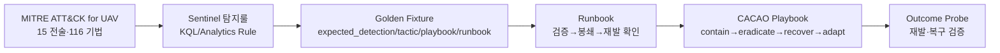
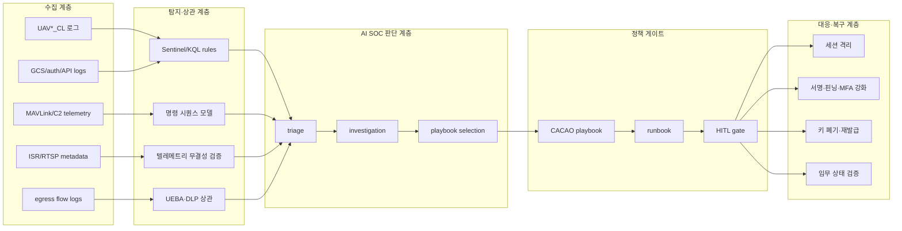

# 3. 공격 시나리오 대응 방어 아키텍처 수립
## 3.1 방어 대상 자산과 관측 지점

방어 아키텍처는 자산 식별에서 출발한다. UAV 방어에서 기체만을 관측 대상으로 삼는 접근은 부적절하다. 2장에서 제시한 바와 같이 공격자는 기체, 데이터링크, 지상 SW, ISR 저장소, 운용자 계정을 번갈아 경유한다. 방어 역시 동일한 자산 경계를 따라 관측점을 배치해야 한다.

| 방어 평면 | 주요 자산 | 관측 신호 | 대표 공격 연결 |
|---|---|---|---|
| C2 링크 | `datalink-los`, `datalink-satcom`, MAVLink 라우터 | RTT 급변, 시퀀스 점프, HEARTBEAT 송신자 변화, 모드 ACK 불일치 | A 제어권 탈취 |
| 비행제어 애플리케이션 | `av-mpd`(ArduPilot FCC), QGC/GCS | 모드 전환, command ACK, arm/disarm 상태, failsafe 상태 | A 제어권 탈취 |
| 지상 SW/API | `pgse`류 API, 함대관리 API, stub 서비스 | IDOR, 비정상 객체 접근, 권한 없는 임무·스트림 조회 | B 영상 변조 |
| ISR·텔레메트리 | EO/IR RTSP, SAR 좌표, `UAV*_CL`, ISR 메타데이터 | 프레임 순서 불일치, 좌표 오버레이 불일치, 메시지 서명 실패, 저장값 변조 | B 영상 변조, C 데이터 유출 |
| 사이버 페르소나 | `auth-stub`, GCS 계정, 세션 토큰 | 로그인 실패 급증, 비정상 시간·위치·디바이스, 세션 직후 민감자산 접근 | C 데이터 유출 |
| egress | C2 채널, 웹 서비스, 외부 저장소 | 대량 outbound, 키·영상 접근 직후 전송, 비인가 목적지 | C 데이터 유출 |

탐지 가능성과 실제 탐지는 구분되어야 한다. 로그가 존재하더라도 탐지룰이 없으면 공격을 놓친다. 반대로 탐지룰이 있더라도 자산 상태와 연결하지 않으면 공격이 정상 운영 이벤트로 관측된다. `pollack-ai`가 UAV*_CL 로그를 단순 이벤트가 아니라 임무 시스템 상태 변화로 해석하는 근거가 여기에 있다. 명령·영상·계정·egress가 하나의 캠페인 안에서 이어지는 방식을 묶어야 방어가 킬체인을 차단할 수 있다.

## 3.2 사전 정의 방어 계약: 탐지룰 · Golden Fixture · Runbook · Playbook

방어는 공격 발생 이후 즉흥적으로 구성되지 않는다. `pollack-ai`에는 MITRE ATT&CK for UAV의 15개 전술 순서를 기준으로 탐지룰, Golden Fixture, Runbook(룰북), CACAO Playbook을 사전에 묶어 두었다. 2장의 ATT&CK for UAV 매트릭스가 공격자의 전술판이라면, 이 절의 네 산출물은 동일한 전술판을 방어자의 운영 계약으로 전환한다. 계약을 먼저 정의한 뒤, 3.3절에서 이 계약을 사용하는 방어 판단의 전체 흐름을 본다.

먼저 공격 기법을 ATT&CK for UAV 전술에 배치하고, 그 전술에 맞는 방어 대응을 D3FEND 기법으로 고른다. 그 다음 Sentinel 탐지룰이 어떤 신호를 잡을지 정의하고, Golden Fixture가 "이 탐지는 어떤 전술·플레이북·룰북으로 이어져야 하는가"를 기대값으로 잠근다. Runbook은 운용자가 어떤 순서로 검증·봉쇄·재발 확인을 할지 정하고, CACAO Playbook은 전술 단위의 봉쇄·축출·복구·적응 워크플로우를 고정한다.



이 구조는 네 가지 프레임워크 원칙을 반영한다. MITRE ATT&CK for UAV는 공격을 전술·기법 언어로 정규화한다. D3FEND는 그 공격 기법에 대응할 방어 기법을 고르는 기준이 된다. NIST SP 800-61r3는 탐지 이후 분석·대응·복구가 한 생애주기로 이어져야 한다는 사고처리 원칙을 제공한다. OASIS CACAO 2.0은 대응 절차를 사람이 읽는 문서 대신 기계가 검증할 수 있는 playbook workflow로 고정한다. 이렇게 네 산출물은 하나의 결정론 사슬을 이룬다. 이 절에서는 파일 스키마를 먼저 설명하고, 각 시나리오에서 파일명 또는 계약 기준을 들어 적용 예를 설명한다.

| 산출물 | 프레임워크 반영 | 설계상 의미 |
|---|---|---|
| Sentinel 탐지룰 | NIST 800-61r3의 Detect/Analyze 원칙을 KQL과 incident 생성 규칙으로 구현 | 어떤 로그를 어떤 시간창에서 분석하고, 어떤 ATT&CK 전술·기법으로 사건화할지 고정 |
| Golden Fixture | ATT&CK 전술판과 CACAO/Runbook 선택을 회귀 테스트 가능한 기대값으로 연결 | 탐지가 발생했을 때 SOC가 엉뚱한 전술·플레이북·런북으로 흐르지 못하게 함 |
| Runbook | NIST 사고처리의 검증→봉쇄→재검증 흐름을 운용 절차로 고정 | 알림을 보고 사람이 새 절차를 만들지 않고, 정해진 검증·봉쇄·재발 확인 순서를 따름 |
| CACAO Playbook | CACAO 2.0의 workflow, agent, action, if-condition 구조를 사용. NIST IR 단계는 `contain`, `eradicate`, `recover`, `adapt` 라벨로 반영 | 전술 단위 대응을 사전 계약으로 만들고, 고위험 임무영향은 HITL 분기로 상승 |

네 파일은 키로 연결된다. Golden Fixture의 `expected_detection.sentinel_rule`은 Sentinel 탐지룰 파일명을 가리키고, `expected_runbook_id`는 Runbook의 `id`와 일치해야 한다. Runbook의 `detection_rule`은 같은 탐지룰 파일명을 다시 참조하고, `playbook_id`는 CACAO Playbook의 `id`와 일치해야 한다. 마지막으로 `expected_tactic`, Runbook의 `tactic`, Playbook의 `tactic`이 같은 ATT&CK for UAV 전술을 가리켜야 한다. 즉 연결축은 `scenario_id → detection_rule → runbook_id → playbook_id → tactic`이다.

먼저 Sentinel 탐지룰은 Azure Sentinel Analytics Rule JSON이다. `query` 하나에 그치지 않고 탐지 주기·분석 기간·심각도·ATT&CK 전술·기법·엔터티 매핑까지 함께 갖춰야 한다. 아래 `_file`은 설명을 위한 경로 표기이며 실제 ARM 스키마 필드는 아니다.

```json
{
  "_file": "sentinel/Analytic Rules/S1_GNSS_Spoofing.json",
  "kind": "Scheduled",
  "properties": {
    "displayName": "UAV S1 - GNSS Spoofing via EKF Variance Anomaly",
    "severity": "High",
    "query": "UAVTelemetry_CL | where MsgType == \"EKF_STATUS_REPORT\" | ...",
    "queryFrequency": "PT10M",
    "queryPeriod": "P1D",
    "tactics": ["Collection", "ImpairProcessControl", "InhibitResponseFunction"],
    "techniques": ["T0830", "T0856", "T0831", "T0815"],
    "customDetails": {"TriggerReason": "TriggerReason"},
    "entityMappings": [{"entityType": "Host", "fieldMappings": [{"identifier": "HostName", "columnName": "UAVId"}]}]
  }
}
```

Golden Fixture는 "이 탐지가 어떤 대응으로 이어져야 하는가"를 잠그는 YAML이다. 탐지룰 이름, 기대 전술, 기대 CACAO Playbook, 기대 Runbook, 기대 회복 수준을 한 파일에 둔다. 이 값은 회귀 테스트의 기대값이다. 아래는 대표 골격이며, 여기서 `expected_detection.sentinel_rule`은 탐지룰 파일명과, `expected_runbook_id`는 Runbook의 `id`와, `expected_cacao_playbook_id`는 CACAO Playbook의 `id`와 맞아야 한다.

```yaml
# file: benchmarks/eval_scenarios/S24-DATALINK-C2-TAKEOVER.yaml
fixture_id: FX-S24-C2-TAKEOVER
scenario_id: S24-DATALINK-C2-TAKEOVER
asset_id: C2_LINK
expected_detection:
  sentinel_rule: S24_Datalink_C2_Takeover.json
expected_tactic: CommandAndControl
expected_cacao_playbook_id: playbook--uav-c2-0001
expected_runbook_id: RB-S24-DATALINK-C2-TAKEOVER
expected_resilience_level: MINIMAL
```

Runbook은 시나리오 단위 운용 절차다. 탐지룰과 플레이북을 연결하고, 운용자가 어떤 증거를 확인해야 하며, 어떤 단계로 대응하고, 승인과 재발 검증이 필요한지를 정한다. 여기서 `detection_rule`은 Sentinel 탐지룰 파일명과 같고, `playbook_id`는 CACAO Playbook의 `id`와 같다. `operator_steps`는 NIST 사고처리 흐름을 운용자 절차로 내린 부분이다.

```yaml
# file: core/policy/runbooks.yaml
- id: RB-S24-DATALINK-C2-TAKEOVER
  scenario_id: S24-DATALINK-C2-TAKEOVER
  detection_rule: S24_Datalink_C2_Takeover.json
  playbook_id: playbook--uav-c2-0001
  tactic: CommandAndControl
  operator_steps: [validate_detection, execute_playbook_containment, verify_no_reoccurred]
  approval: {required: true, reason: "임무·자격·링크 영향 가능 조치"}
  verification: {method: outcome_probe, expected: no_reoccurred}
```

CACAO Playbook은 전술 단위 대응 워크플로우다. `workflow_start`에서 시작해 action과 if-condition을 따라 봉쇄·축출·복구·검증·적응으로 이어진다. 고위험 전술은 임무위험 게이트를 통과해야 하고, 위험이 높으면 HITL 경로로 갈라진다. Runbook의 `playbook_id`가 이 파일의 `id`를 가리키고, Golden Fixture의 `expected_cacao_playbook_id`도 같은 값을 가져야 한다.

```yaml
# file: core/policy/cacao-playbooks.yaml
- type: playbook
  spec_version: cacao-2.0
  id: playbook--uav-c2-0001
  name: UAV 명령제어 대응 - 비인가 C2 채널
  tactic: CommandAndControl
  workflow_start: start--0
  workflow:
    start--0:
      type: start
      on_completion: action--contain
    action--contain:
      type: action
      name: 봉쇄
      on_completion: if--mission-gate
    if--mission-gate:
      type: if-condition
      condition: 'mission_risk.score >= 6 or mission_risk.factors["civil_geo"] >= 1'
      on_true: action--contain-hitl
      on_false: action--contain-auto
```

본 방어 아키텍처는 탐지룰 일부를 구성하는 데 그치지 않는다. MITRE ATT&CK for UAV 전술판을 기준으로 탐지와 대응을 미리 엮어 두었고, 각 연결은 파일로 검증된다. 탐지룰은 Sentinel Analytics Rule JSON 형식으로 정의하고, 직접 배포 파일이 없는 항목은 `runbooks.yaml`의 `detection_rule` 파일명 계약으로 관리한다. Golden Fixture는 기대 대응을 잠그며, Runbook은 운용 절차를 정하고, CACAO Playbook은 전술 단위 대응을 기계 검증 가능한 workflow로 고정한다.

## 3.3 방어 아키텍처 전체 구조

전체 방어 구조는 다섯 계층으로 나뉜다. 아래 계층은 물리적 배치 순서를 뜻하지 않는다. 방어 판단이 흐르는 순서다. 센서와 로그가 들어오고, 상관분석이 공격 단계를 판정하며, AI SOC가 대응 후보를 만들고, 결정론 정책이 실행 가능 여부를 검증한 뒤, 복구와 재검증으로 닫힌다. 이 흐름은 NIST SP 800-61r3의 Detect·Respond·Recover 사고처리 흐름을 UAV 임무 시스템에 맞춰 내린 것이다. 탐지는 경보 생성에서 끝나지 않고, 대응은 차단 명령에서 끝나지 않으며, 복구는 임무 상태가 안전 기준선으로 돌아왔는지 확인할 때 끝난다.



워크플로우는 여섯 단계로 순환한다.

| 단계 | 입력 | 판단 | 출력 | 반영한 원칙 |
|---|---|---|---|---|
| ① 수집 | UAV*_CL, C2, GCS, API, ISR, egress 로그 | 자산·세션·임무 ID 정규화 | 공통 사건 객체 | NIST 800-53의 조직 자산 보호 관점: 통제는 단일 장비가 아니라 임무 자산 전체에 걸쳐 적용 |
| ② 탐지 | 정규화 사건 | KQL·시퀀스·무결성·UEBA 룰 | 공격 단계 후보 | D3FEND의 countermeasure technique 원칙: ATT&CK 기법마다 방어 기법을 대응시킴 |
| ③ 조사 | 공격 단계 후보 | 자산 상태, 운용자 조작 이력, 이전 단계와 상관 | 캠페인 가설 | NIST 800-61r3의 분석 원칙: 사건 관련 데이터를 모아 우선순위와 대응을 결정 |
| ④ 대응 선택 | 캠페인 가설 | 전술·피해·임무위험 기준으로 플레이북 선택 | CACAO Playbook ID | CACAO 2.0의 워크플로우 원칙: 대응 절차를 기계가 읽는 단계형 playbook으로 고정 |
| ⑤ 정책 게이트 | Playbook, Runbook, MissionRisk | 자동 가능/인간 승인/차단 불가 판정 | 실행 승인 또는 HITL 상승 | 방산 안전 원칙: 물리 비가역·민간 근접·주력자산은 자동 처리하지 않음 |
| ⑥ 복구·검증 | 실행 결과, outcome probe | 공격 재발·키/세션/임무 상태 확인 | 정상화 또는 재대응 | NIST 사고처리의 Recover와 lessons learned: 복구 후 개선 우선순위까지 반영 |

### AI 판단 흐름: 사건 연결에서 정책 게이트까지

이 흐름에서 AI SOC의 역할은 새로운 방어 결정을 즉석에서 생성하는 것이 아니라, 단계 사이의 의미 손실을 줄이는 것이다. 원시 로그를 사건 카드로 만들고, 사건 카드를 공격 전술 후보로 정렬하고, 전술 후보를 캠페인 가설로 묶고, 그 가설을 사전 정의된 Playbook·Runbook 계약에 연결한다. 마지막에는 실행 결과를 다시 검증·개선 입력으로 돌린다. 즉 AI는 판단을 보조하지만, 실행 권한과 정책 게이트는 결정론 모듈에 남긴다.

출발점은 로그다. UAV*_CL, C2 telemetry, GCS/auth/API 로그, ISR metadata, egress flow가 서로 다른 형식으로 들어오면 AI는 이를 자산 ID, 세션 ID, 임무 ID, 시간창 기준으로 맞춰 하나의 사건 카드로 만든다. 예를 들어 C2 링크 이상, GCS 로그인, ISR 스트림 변화가 따로 들어와도 같은 임무 시간축 위에 놓는다. 이 단계의 출력은 "공통 사건 객체"다. 다만 공격 여부를 여기서 단정하지 않는다. 로그 스키마, 자산 목록, 시간창 규칙 같은 결정론 기준을 먼저 통과해야 다음 단계로 넘어간다.

정규화된 사건이 만들어지면 AI는 사건 카드를 ATT&CK for UAV 전술 후보로 정렬한다. KQL·시퀀스·무결성·UEBA 룰이 낸 신호를 받아, 이것이 Command and Control의 일부인지, Collection·Stealth/Evasion의 일부인지, Exfiltration의 일부인지 배치한다. 같은 경보라도 전술 위치가 달라지면 대응도 달라진다. 그래서 이 단계의 출력은 "공격 단계 후보"다. 반대로 탐지룰이 없는 신호를 AI가 탐지 완료로 간주해서는 안 된다. Sentinel/KQL 룰, 임계값, watchlist가 만든 결과가 탐지의 1차 근거다.

공격 단계 후보가 나오면 AI는 조사 단계에서 이를 캠페인 가설로 승격시킨다. 관련 증거를 모아 시간순 타임라인을 만들고, 정상 운용 지연·제어권 탈취·영상 변조·계정 기반 유출 같은 대안 가설을 비교한다. 여기서 AI는 분석관의 시간을 줄이는 역할을 한다. 어떤 자산에서 시작해 어떤 자산으로 넘어갔는지, 어떤 증거가 어느 가설을 지지하거나 반박하는지를 정리한다. 그러나 단일 LLM 요약만으로 정탐 판정을 확정하지 않는다. 출처가 있는 증거, 상관분석 결과, 보수적 판정 규칙이 함께 있어야 한다.

캠페인 가설은 대응 실행으로 바로 이어지지 않는다. AI는 먼저 가설의 전술, 피해 자산, 임무위험을 기준으로 사전 정의된 Playbook·Runbook 후보를 찾는다. 같은 Exfiltration이라도 SAR 좌표 유출과 키 재료 유출은 다른 대응으로 갈라진다. AI는 이 차이를 설명하고 적절한 대응 계약을 제안한다. 선택 가능한 범위는 Golden Fixture 기대값, CACAO Playbook ID, Runbook ID를 벗어나지 않는다. 즉 사고 중에 새로운 대응 절차를 즉석 생성해 실행하는 구조가 아니다.

```python
# agents/response_agent.py - 사전 정의 Playbook/Runbook 표면화 경로
cpb = select_playbook(tactic, self._playbooks)
plan = resolve_playbook(cpb, mission_risk)      # mission_risk None이면 보수 분기
cacao_id, cacao_steps, mission_branch = plan.playbook_id, plan.steps, plan.mission_branch
runbook, runbook_status = self._resolve_runbook(alert, cacao_id)
```

대응 후보가 정해져도 최종 결심은 정책 게이트를 통과해야 한다. AI는 임무위험, 민간 근접성, 자산 등급, 조치의 비가역성을 설명하고 HITL 상승 필요 여부를 제안한다. 하지만 AI는 승인권자가 아니다. 키 폐기, 링크 차단, 비행 상태 변경 같은 고위험 조치는 AI가 단독 결정하지 않는다. commander intent, CACAO 조건문, Runbook의 `approval.required`, HITL 승인이 최종 게이트가 된다. 이 때문에 방어 AI는 신속하게 판단하되, 위험한 조치는 보수적으로 중단한다.

대응 이후에도 AI의 역할은 끝나지 않는다. outcome probe 결과를 해석해 공격 재발 여부와 세션·키·권한·임무 상태가 정상화됐는지를 요약한다. 정상화 판단은 outcome probe, 회귀 테스트, 운용자 확인을 근거로 한다. 실패한 대응이나 재발 신호가 있으면 이를 숨기지 않고 다시 조사·대응 선택 단계로 돌린다. 오탐·미탐이 확인되면 watchlist, fixture, runbook 보강 후보를 제안하되, 배포 중인 KQL 본문이나 운영 정책을 검증 없이 직접 수정하지 않는다. 개선안은 PR·검토·회귀 테스트를 거쳐 운영 계약에 반영된다.

이 구조에서 LLM의 위치도 분명하다. LLM은 요약, 가설 정리, 증거 설명, 플레이북 후보 설명에는 쓸 수 있지만, 심각도 하한·정탐 판정·HITL 상승·실행 가능 여부는 결정론 정책이 정한다. 방산 UAV 방어에서 이 구분은 중요하다. 잘못된 자동 대응은 공격만큼 위험할 수 있기 때문이다. `pollack-ai`는 LLM을 "판정자"가 아니라 "조사 보조자"로 두고, 실제 차단과 복구는 Runbook, CACAO 조건, commander intent, HITL 게이트가 결정하게 한다. 여기서는 방어 아키텍처 안에서 AI가 맡는 책임만 설명하고, 에이전트 내부 상태 그래프와 모듈 구현은 4.3절에서 분리해 다룬다.

### 능동 헌팅: Forward Hunting과 Backward Hunting

이 판단 흐름에 능동 헌팅이 붙는다. 헌팅은 탐지를 대체하는 별도 판정기가 아니라, 탐지룰이 만든 공격 단계 후보를 더 넓은 시간축으로 확장해 "이 알림 앞뒤에 무엇이 있었는가"를 확인하는 보강 루프다. 구현 수준의 헌팅 에이전트 구조는 4.3절에서 다루고, 여기서는 방어 아키텍처 안에서 어떤 판단을 보강하는지만 설명한다.

Forward hunting은 현재 관측된 공격 단계에서 다음에 일어날 가능성이 높은 행위를 먼저 찾는 방식이다. 예를 들어 A에서 비인가 C2 세션이 보이면, 아직 제어권 상실 알람이 발생하지 않았더라도 무허가 `COMMAND_LONG`, 모드 전환 ACK, failsafe 상태 변화를 짧은 미래 시간창에서 확인한다. B에서 RTSP 세션 이상이 보이면 이후 프레임 순서 불일치, 오염된 메타데이터 저장, GCS 화면 불일치를 찾는다. C에서 계정 이상 로그인이 보이면 이후 SAR 좌표 조회, 키 저장소 접근, outbound 증가를 추적한다. 즉 Forward hunting의 목적은 공격자가 다음 자산으로 넘어가기 전에 선행 차단 지점을 찾는 것이다.

Backward hunting은 반대로 현재 알림이 나오기 전의 침투·준비 흔적을 되짚는다. A에서 무허가 명령이 발견되면 그 전에 비인가 PeerIp가 링크에 붙었는지, 정상 GCS 세션이 하이재킹됐는지, 키·토큰 재사용 흔적이 있었는지 확인한다. B에서 조작된 영상이 발견되면 그 전에 API 객체 열거, RTSP 재협상, 메타데이터 쓰기 실패가 있었는지 본다. C에서 outbound 유출이 포착되면 그 전에 로그인 실패 급증, MFA 우회, 권한 상승, 키 저장소 조회가 있었는지 거슬러 올라간다. Backward hunting의 목적은 이미 보인 피해를 원인 사건과 연결해 캠페인 범위를 확정하는 것이다.

이때 캠페인(campaign) 개념이 필요하다. 단일 알림은 하나의 점에 가깝다. 하지만 공격자는 보통 C2 링크, 계정, API, ISR 저장소, egress를 순서대로 지나가며 여러 작은 흔적을 남긴다. AI SOC는 개별 알림을 바로 사건 종결로 보지 않고, 같은 시간창·자산·계정·기법·목적을 공유하는 알림을 하나의 캠페인 후보로 묶는다. 이렇게 묶으면 처음에는 중요하지 않아 보였던 증거가 다시 의미를 얻는다. 예를 들어 평범한 RTSP 재협상 로그는 단독으로는 낮은 심각도지만, 직후 영상 메타데이터 변조와 GCS 화면 불일치가 따라오면 B 시나리오의 중간 단계 증거가 된다.

Threat actor profile은 이 캠페인 후보를 다시 읽는 두 번째 렌즈다. 여기서 프로필은 특정 국가·조직을 단정하는 attribution이 아니다. 반복적으로 관측되는 선호 기법, 접근 자산, 시간대, 조용한 우회 방식, 목표 데이터 유형을 모은 작전적 특성이다. 예컨대 링크 장악보다 계정과 egress를 선호하는 행위자는 C 시나리오의 데이터 유출 경로를 먼저 의심하게 만들고, 영상·메타데이터 변조를 반복하는 행위자는 B 시나리오의 ISR 신뢰도 훼손 경로를 먼저 보게 만든다. 이 프로필은 정답을 주는 것이 아니라, 놓친 증거를 다시 찾을 우선순위를 정한다.

```python
# core/campaign.py, core/correlation.py - 다중 알림을 캠페인 후보로 묶는 경로
campaign = CampaignDetector().group(alerts, keys=["time_window", "asset", "account", "technique"])
evidence_graph = correlate(campaign, edges=["shared_ioc", "asset_dependency", "tactic_progression"])
```

```python
# core/killchain.py, core/killweb.py - 관측 TTP를 UAV 전술 진행 상태로 사상
progress = KillChainProgressor().map_observations(observed_ttps)
killweb = KillWebBuilder().build(progress, coverage_by_tactic)
```

따라서 AI의 재판단은 "새로운 사실을 상상"하는 과정이 아니다. 기존 로그를 캠페인과 threat actor profile이라는 맥락 안에서 다시 정렬하는 과정이다. 처음에는 오탐처럼 보였던 로그인 실패, 짧은 API 열거, 작은 outbound 증가, 일시적 프레임 순서 오류가 같은 캠페인 후보 안에 들어오면 재평가된다. 반대로 프로필과 맞지 않는 증거는 억지로 끼워 맞추지 않고 대안 가설로 남긴다. 이 보수적 재판단 덕분에 AI SOC는 놓친 증거를 다시 볼 수 있지만, 특정 행위자 프로필에 과잉 확신해 대응을 자동 실행하지 않는다.

두 헌팅은 방향만 다르고 같은 원칙을 따른다. 둘 다 read-only 질의로 증거를 넓히며, 대응 실행권을 갖지 않는다. Forward hunting은 다음 단계 차단을 빠르게 만들고, Backward hunting은 누락된 초기 침투와 피해 범위를 복원한다. 캠페인과 threat actor profile은 이 두 헌팅이 찾은 증거를 재해석하는 분석 렌즈다. 이렇게 해야 AI SOC가 단일 알림을 과대평가하지 않으면서도, 실제 캠페인을 과소평가하지 않는다.

## 3.4 시나리오 A 대응: UAV 제어권 탈취 방어

시나리오 A의 공격 경로는 C2 세션 장악(T1071) → 무허가 명령 주입(T0855) → 제어권 상실·조작(T0827/T0831)이다. 방어 목표는 제어권 전환이 일어나기 전, 링크와 명령 평면에서 킬체인을 끊는 것이다.

본 설계는 D3FEND를 기법 명칭 표기가 아니라 방어 위치 선정 도구로 활용한다. T1071은 네트워크 트래픽 분석으로, T0855는 메시지 인증과 명령 검증으로, T0827/T0831은 세션 격리와 권한 회수로 대응한다. 공격 기법이 링크에서 명령으로, 명령에서 제어권 상태로 이동하므로 방어 역시 동일한 순서로 배치한다.

**탐지.** 첫 관측점은 `datalink-los`다. C2 세션의 RTT 급변, MAVLink 시퀀스 번호 점프, HEARTBEAT 송신자 집합 변화, 정상 GCS 조작 이력과 맞지 않는 모드 전환 ACK를 상관한다. 단일 패킷만 관측하면 공격 메시지는 정상 MAVLink처럼 보일 수 있다. 따라서 탐지 단위는 패킷의 도착 여부가 아니라, 현재 조종권 상태에서 해당 송신자가 해당 명령을 발행할 수 있는지에 있어야 한다.

NIST 800-61r3의 Detect 단계는 단순 경보 생산이 아니라 사건 우선순위와 대응 결정을 위한 분석까지 포함한다. 이 원칙을 반영해 A의 탐지는 링크 경보 하나로 끝내지 않는다. 링크 이상, 명령 시퀀스, 운용자 조작 이력, `av-mpd` ACK를 하나의 사건으로 묶은 뒤에만 제어권 탈취 캠페인으로 올린다. 이렇게 해야 정상 통신 지연과 실제 하이재킹을 구분할 수 있다.

**차단.** MAVLink2 signing을 강제하고, GCS↔기체 상호인증을 적용한다. 서명 검증에 실패한 명령은 `datalink-los` 또는 GCS 게이트웨이에서 폐기한다. 그 위에 operator authority lock을 둔다. 현재 조종권 소유자와 승인된 운용자 세션이 일치하지 않는 제어권 전환은 거부한다. 이중 방어가 필요한 이유는 메시지 서명만으로는 탈취된 정규 세션을 막지 못하고, 세션 잠금만으로는 무서명 링크 주입을 막지 못하기 때문이다. NIST 800-53의 접근통제와 시스템 무결성 통제 원칙을 UAV 명령 평면에 적용하면, "연결을 허용했다"와 "명령을 수행해도 된다"는 별개 판단이어야 한다. 그래서 링크 인증과 명령 권한 검사를 분리했다.

**복구.** 제어권 탈취 징후가 확인되면 세션 격리, 키 폐기, 링크 재협상, 운용자 재인증을 수행한다. 비행 상태가 안전하면 RTL(Return-to-Launch) 또는 loiter 같은 안전 복귀 절차를 검토하되, disarm·flight termination 같은 물리 비가역 명령은 자동 실행하지 않는다. 고위험 대응은 HITL로 상승한다.

CACAO 2.0의 playbook 원칙은 대응 절차를 단계형 워크플로우로 고정하는 것이다. A의 대응도 "탐지 → 세션 격리 → 키 폐기 → 운용자 재인증 → 안전 상태 검증"의 순서를 Runbook으로 고정한다. AI가 그때그때 새로운 대응을 지어내지 않는다. 비가역 조치는 playbook 안에서 HITL 분기로만 연결된다.

**사전 정의 파일 계약.** A는 `pollack-ai`에서 네 산출물이 가장 정연하게 이어지는 사례다. `S24-DATALINK-C2-TAKEOVER` 계약이 데이터링크 나포를 C2 전술로 고정하고, C2 링크 대응 플레이북으로 연결한다.

| 산출물 | 파일 | 핵심 필드 | 설계 반영 |
|---|---|---|---|
| 탐지룰 | `S24_Datalink_C2_Takeover.json` | Runbook의 `detection_rule`로 참조 | 비인가 `PeerIp`, 화이트리스트 밖 GCS, 비정상 링크 상태를 C2 장악 신호로 해석하도록 계약 |
| Golden Fixture | `benchmarks/eval_scenarios/S24-DATALINK-C2-TAKEOVER.yaml` | `asset_id: C2_LINK`, `expected_tactic: CommandAndControl`, `expected_cacao_playbook_id: playbook--uav-c2-0001`, `expected_runbook_id: RB-S24-DATALINK-C2-TAKEOVER` | 탐지 결과가 C2 전술과 C2 대응 플레이북으로 이어져야 함을 회귀 기대값으로 고정 |
| Runbook | `core/policy/runbooks.yaml`의 `RB-S24-DATALINK-C2-TAKEOVER` | `operator_steps: validate_detection → execute_playbook_containment → verify_no_reoccurred`, `approval.required: true` | 링크 차단은 임무 지속성에 영향을 주므로 자동 처리만 하지 않고 승인 경로를 요구 |
| Playbook | `core/policy/cacao-playbooks.yaml`의 `playbook--uav-c2-0001` | `tactic: CommandAndControl`, `workflow_start: start--0`, contain/eradicate/recover/verify/adapt 단계 | 비인가 C2 채널을 봉쇄하고, 링크 재구성·복구 검증까지 하나의 CACAO workflow로 고정 |

이 네 파일의 조합이 A의 방어 논리를 실제 운영 절차로 만든다. D3FEND의 Network Traffic Analysis는 탐지룰의 링크 상태 분석으로 내려오고, NIST 800-61r3의 대응 생애주기는 Runbook의 세 단계와 CACAO의 contain→recover 흐름으로 내려온다. 특히 Golden Fixture의 `expected_resilience_level: MINIMAL`과 `expected_fallback_contains: "페일세이프"`는 C2_LINK가 T1-Critical 자산이므로 완전 임무 지속보다 페일세이프 전환이 우선이라는 방산 운용 판단을 문서가 아니라 테스트 기대값으로 잠근다.

아래 네 조각이 A의 대표 계약이다. 파일 간 연결과 필드 의미가 드러나도록 핵심만 발췌했다.

```json
// sentinel/Analytic Rules/S24_Datalink_C2_Takeover.json - A 탐지룰 대표 계약
{
  "displayName": "UAV S24 - Datalink C2 Takeover",
  "severity": "High",
  "query": "UAVDatalink_CL | where PeerIp !in (C2_Whitelisted_GCS_List) | summarize by UAVId, PeerIp, SessionId",
  "tactics": ["CommandAndControl", "Impact"],
  "techniques": ["T1071", "T0855", "T0827", "T0831"]
}
```

```yaml
# benchmarks/eval_scenarios/S24-DATALINK-C2-TAKEOVER.yaml - A Golden Fixture 대표 계약
asset_id: C2_LINK
expected_tactic: CommandAndControl
expected_cacao_playbook_id: playbook--uav-c2-0001
expected_runbook_id: RB-S24-DATALINK-C2-TAKEOVER
expected_resilience_level: MINIMAL
expected_fallback_contains: "페일세이프"
```

```yaml
# core/policy/runbooks.yaml - A Runbook 대표 계약
- id: RB-S24-DATALINK-C2-TAKEOVER
  scenario_id: S24-DATALINK-C2-TAKEOVER
  detection_rule: S24_Datalink_C2_Takeover.json
  playbook_id: playbook--uav-c2-0001
  tactic: CommandAndControl
  operator_steps: [validate_detection, execute_playbook_containment, verify_no_reoccurred]
  approval: { required: true, reason: "C2 링크 차단·페일세이프 전환 가능" }
```

```yaml
# core/policy/cacao-playbooks.yaml - A CACAO Playbook 대표 계약
- id: playbook--uav-c2-0001
  tactic: CommandAndControl
  workflow_start: start--0
  workflow:
    action--contain:
      type: action
      name: 비인가 C2 세션 봉쇄
      commands: [{type: manual, command: "화이트리스트 외 C2 세션 차단"}]
      on_completion: if--mission-gate
    if--mission-gate:
      type: if-condition
      condition: 'mission_risk.score >= 6 or mission_risk.factors["civil_geo"] >= 1'
      on_true: action--contain-hitl
      on_false: action--recover-link
```

**AI 판단 흐름.** A에서 AI는 C2 링크 이벤트를 단독 경보로 보지 않고 `datalink-los` 세션, MAVLink HEARTBEAT 송신자, `av-mpd` ACK, 운용자 조작 이력을 하나의 사건 카드로 묶는다. 그 다음 "비인가 세션이 정상 GCS처럼 보이는가", "모드 전환이 승인된 조종권 상태와 맞는가", "링크 지연만으로 설명 가능한가"라는 가설을 비교해 제어권 탈취 캠페인 후보를 만든다. 대응 선택 단계에서는 `CommandAndControl` 전술과 `C2_LINK` 자산 등급을 근거로 `playbook--uav-c2-0001`과 `RB-S24-DATALINK-C2-TAKEOVER`를 제안한다. 다만 AI는 링크 차단이나 페일세이프 전환을 직접 결정하지 않는다. C2 링크는 임무 지속성과 직결되므로, `approval.required: true`와 HITL 게이트가 최종 결심점이다.

| 공격 단계 | 방어 관측 | 차단·복구 | D3FEND 매핑 | 상태 |
|---|---|---|---|---|
| T1071 C2 세션 | RTT·시퀀스·HEARTBEAT 이상 | 세션 격리, 링크 재협상 | Network Traffic Analysis | 배치 |
| T0855 무허가 명령 | 모드 전환·ACK 불일치 | MAVLink2 signing, 송신자 인증 | Message Authentication | 보강 최우선 |
| T0827/T0831 제어권 영향 | 조종권 상실 알람 | operator authority lock, 키 폐기 | Credential Eviction | 배치 |

시나리오 A의 핵심 방어 공백은 T0855다. 링크가 형식상 정상인 명령을 받아들이면, 공격은 정상 제어 트래픽처럼 지나간다. 따라서 A의 최우선 보강은 "명령 무결성"이다. 네트워크 이상 탐지는 필요조건이고, 명령 송신자·세션·상태 전이 검증이 충분조건이다.

## 3.5 시나리오 B 대응: ISR 영상·텔레메트리 변조 방어

시나리오 B의 공격 경로는 API 인증우회(T1190) → 텔레메트리 저장값 변조(T1565.001) → 영상 중간자(T1557) → 운용자 시야 조작(T0832)이다. 이 공격은 기체 제어에 직접 관여하지 않는다. 따라서 비행 안정성만 관측하는 방어는 실패한다. 방어 목표는 운용자 화면을 구성하는 데이터 경로의 무결성을 보장하는 것이다.

B는 방어 프레임워크를 가장 조심해서 적용해야 하는 지점이다. 일반 IT 사고대응은 서버 침해와 데이터 변조를 중심으로 보지만, UAV ISR에서는 변조된 데이터가 운용자 판단으로 이어진다. 그래서 D3FEND의 Stored Data Integrity와 Encrypted Transport 원칙을 단순 저장소 보호가 아니라 "센서 이벤트에서 GCS 화면까지의 provenance 보존"으로 해석했다.

**탐지.** 진입점은 지상 SW/API다. `pgse` 또는 함대관리 API에서 객체 단위 권한검사를 우회한 접근, 평소 권한 범위 밖의 임무·기체·스트림 식별자 조회, 동일 세션의 빠른 객체 열거를 잡는다. 핵심은 그 다음 단계에 있다. 텔레메트리 버스와 ISR 메타데이터 저장소에서 producer identity, 메시지 서명, 체크섬, 타임스탬프 단조성, 프레임 시퀀스를 검증해야 한다. 원본 센서 이벤트와 GCS 표시값이 어긋나는지도 비교한다.

NIST 800-53의 통제 카탈로그는 통제를 조직 운영과 자산 보호를 위한 위험관리 수단으로 본다. 이 원칙을 B에 적용하면, API 인증만으로는 부족하다. 보호 대상은 API 서버가 아니라 임무 판단에 쓰이는 ISR 데이터다. 따라서 권한검사, 텔레메트리 서명, 저장소 무결성, 영상 세션 검증을 한 통제 묶음으로 설계한다.

**차단.** API는 객체 단위 인가와 명시적 mission-scope 토큰으로 잠근다. 텔레메트리 메시지는 생산자 서명과 replay 방지값을 붙이고, 검증 실패 메시지는 저장소에 쓰기 전에 폐기한다. RTSP는 SRTP, 인증서 핀닝, 프레임 워터마크로 보호한다. 이 조합은 기체는 정상이나 화면만 오염되는 공격을 대상으로 한다. T1190을 막는 API 통제와 T1565.001을 막는 데이터 무결성 통제를 분리한 이유도 여기에 있다. API가 뚫려도 오염 데이터가 저장되지 않아야 하고, 저장소가 오염돼도 화면 렌더링 단계에서 provenance 불일치를 표시해야 한다.

**복구.** 변조가 확인되면 오염된 텔레메트리·영상 구간을 격리하고 마지막 검증 상태로 롤백한다. 운용자 화면에는 해당 구간의 신뢰도 저하를 표시해, 오염된 상황인식에 근거한 임무 판단을 막는다. 이후 같은 임무의 표적좌표·영상 캡처·판독 결과를 재검증한다.

NIST 사고처리의 Recover 원칙을 그대로 적용하면 "서비스 재개"가 끝이 아니다. B에서는 운용자가 이미 본 화면이 판단을 오염시켰을 수 있다. 따라서 복구 절차에 영상 신뢰도 경고, 표적좌표 재판독, 임무 로그 정정, 판독 결과 재검증을 포함했다. 이는 사이버 복구와 임무 복구를 분리하지 않기 위한 설계다.

**사전 정의 파일 계약.** B는 하나의 파일로 끝나지 않는다. 영상 변조는 API 진입, 영상 세션 중간자, EO/IR 인식 오염이 결합된 공격이기 때문에 `S7`, `S83`, `S88` 계약을 조합한다. 현재 저장소에서 Golden Fixture가 직접 존재하는 것은 `S88-ADVERSARIAL-PATCH-ATTACK.yaml`이며, RTSP/EOIR 인터셉트는 `runbooks.yaml`에 탐지룰·런북 계약으로 정의돼 있다.

| 방어 축 | 탐지룰 계약 | Golden Fixture | Runbook | Playbook |
|---|---|---|---|---|
| EO/IR 다운링크 중간자 | `S7_EOIR_Downlink_Intercept_Inject.json` | 없음(런북 계약) | `RB-S7-EOIR-DOWNLINK-INTERCEPT-INJECT` | `playbook--uav-coll-0001` |
| RTSP 스트림 하이재킹 | `S83_RTSP_Stream_Hijack.json` | 없음(런북 계약) | `RB-S83-RTSP-STREAM-HIJACK` | `playbook--uav-coll-0001` |
| EO/IR 인식 오염 | `S88_Adversarial_Patch_Attack.json` | `S88-ADVERSARIAL-PATCH-ATTACK.yaml` | `RB-S88-ADVERSARIAL-PATCH-ATTACK` | `playbook--uav-stealth-0001` |

`S7`·`S83`은 AiTM/영상 수집 계열을 Collection 전술로 보고 세션 검증·격리와 SRTP·핀닝으로 대응하며(`playbook--uav-coll-0001`), `S88`은 영상 자체보다 모델 인식 신뢰도 오염을 Stealth/Evasion으로 보고 다중센서 융합과 HITL 표적확인을 요구한다(`playbook--uav-stealth-0001`).

`S88-ADVERSARIAL-PATCH-ATTACK.yaml`은 B의 "화면이 틀리는" 문제를 가장 잘 보여주는 fixture다. `asset_id: PAYLOAD_EOIR`, `expected_tactic: StealthEvasion`, `expected_techniques: ["T1565"]`, `expected_cacao_playbook_id: playbook--uav-stealth-0001`, `expected_runbook_id: RB-S88-ADVERSARIAL-PATCH-ATTACK`을 고정한다. 또한 주석에서 이 룰이 온보드 AI 추론 전용 텔레메트리 부재 때문에 `UAVOpAudit_CL EventType='adversarial_patch'` 관례값으로 근사하는 proxy 룰임을 명시한다. 본 설계는 탐지 공백을 명시하고, 현재 계측 한계를 fixture에 남겨 향후 센서·모델 텔레메트리 보강 대상으로 만든다.

아래 네 조각이 B의 대표 계약이다. `S88`은 Golden Fixture까지, `S7`·`S83`은 탐지룰·런북 계약으로 정의된다.

```json
// sentinel/Analytic Rules/S88_Adversarial_Patch_Attack.json - B 탐지룰 설계 계약
{
  "displayName": "UAV S88 - EO/IR Adversarial Patch or View Manipulation",
  "severity": "Medium",
  "query": "UAVOpAudit_CL | where EventType == 'adversarial_patch' | summarize by UAVId, MissionId, SensorId",
  "tactics": ["DefenseEvasion", "Impact"],
  "techniques": ["T1565", "T0832"]
}
```

```yaml
# benchmarks/eval_scenarios/S88-ADVERSARIAL-PATCH-ATTACK.yaml - B Golden Fixture 대표 계약
asset_id: PAYLOAD_EOIR
expected_tactic: StealthEvasion
expected_techniques: ["T1565"]
expected_cacao_playbook_id: playbook--uav-stealth-0001
expected_runbook_id: RB-S88-ADVERSARIAL-PATCH-ATTACK
notes: "온보드 AI 추론 전용 텔레메트리 부재로 UAVOpAudit_CL proxy 신호 사용"
```

```yaml
# core/policy/runbooks.yaml - B Runbook 설계 계약
- id: RB-S88-ADVERSARIAL-PATCH-ATTACK
  scenario_id: S88-ADVERSARIAL-PATCH-ATTACK
  detection_rule: S88_Adversarial_Patch_Attack.json
  playbook_id: playbook--uav-stealth-0001
  tactic: StealthEvasion
  operator_steps: [validate_detection, isolate_contaminated_window, require_human_relabel, verify_no_reoccurred]
  approval: { required: true, reason: "표적 인식·임무 판단 오염 가능" }
```

```yaml
# core/policy/cacao-playbooks.yaml - B CACAO Playbook 설계 계약
- id: playbook--uav-stealth-0001
  tactic: StealthEvasion
  workflow_start: start--0
  workflow:
    action--contain:
      type: action
      name: 오염 영상·추론 구간 격리
      commands: [{type: manual, command: "EO/IR 신뢰도 하향·오염 구간 표시"}]
      on_completion: action--recover
    action--recover:
      type: action
      name: 다중센서 재검증
      commands: [{type: manual, command: "SAR/INS/운용자 판독으로 표적좌표 재검증"}]
```

Runbook 관점에서 B는 자동 차단보다 신뢰도 하향과 재검증이 먼저다. `RB-S7`과 `RB-S83`은 `playbook--uav-coll-0001`로 이어져 AiTM/영상 캡처 계열 대응을 수행하고, `RB-S88`은 `playbook--uav-stealth-0001`로 이어져 오염된 인식 결과를 보수적으로 다룬다. 이는 D3FEND의 Stored Data Integrity와 Encrypted Transport를 단순 암호화 통제가 아니라 "센서 입력부터 화면 판단까지의 출처 검증"으로 확장한 설계다.

**AI 판단 흐름.** B에서 AI의 핵심 역할은 기체는 정상이나 화면이 오염된 상태를 설명 가능한 사건으로 묶는 것이다. API 접근 로그, RTSP 세션 변화, 프레임 순서, 메타데이터 서명, GCS 표시값을 같은 임무 시간축에 올리고, 영상 변조·중간자·모델 인식 오염 가설을 나눈다. 특히 `S88`처럼 proxy 룰에 의존하는 경우에는 탐지 한계를 숨기지 않고 "직접 센서 텔레메트리 부재로 운영 감사 이벤트를 근사 신호로 사용한다"는 불확실성을 함께 표시한다. 대응 선택 단계에서 AI는 신뢰도 하향, 오염 구간 격리, 재판독, 다중센서 확인을 권고하지만, 표적 판정 취소나 임무 판단 변경을 단독 수행하지 않는다. 운용자가 이미 오염된 화면을 봤을 수 있으므로, 최종 판단은 HITL 재검증과 임무 로그 정정 절차로 닫는다.

| 공격 단계 | 방어 관측 | 차단·복구 | D3FEND 매핑 | 상태 |
|---|---|---|---|---|
| T1190 API 침투 | IDOR, 권한 밖 객체 조회 | 객체 단위 인가, mission-scope 토큰 | Access Mediation | 부분 배치 |
| T1565.001 저장값 변조 | 서명 실패, 원본-표시값 불일치 | 텔레메트리 서명, 저장소 무결성 검증 | Message Integrity · Stored Data Integrity | 신규 배포 최우선 |
| T1557 영상 중간자 | 프레임 순서·워터마크 이상 | SRTP, 인증서 핀닝, 세션 폐기 | Encrypted Transport · Certificate Pinning | 보강 필요 |
| T0832 시야 조작 | 실제 상태와 GCS 화면 불일치 | 신뢰도 경고, 재판독 | User Interface Analysis | 신규 배포 |

시나리오 B는 방어 공백을 보여주는 가장 중요한 사례다. 제어권은 정상이며, 물리 안전 인터록도 정상이다. 그러나 운용자가 인식하는 상황 정보가 오염된다. 따라서 B의 보강 우선순위는 네트워크 차단이 아니라 데이터 생산자 서명, 텔레메트리 무결성, 영상 스트림 무결성이다.

## 3.6 시나리오 C 대응: ISR 데이터·암호키 유출 방어

시나리오 C의 공격 경로는 정규 계정 획득(T1078) → 키·정찰 산출물 접근(T1041) → 외부 반출(T1041/T1565)이다. 이 공격은 기체에 관여하지 않는다. 공격자는 정규 운용자로 위장해 저장소를 읽고, 임무 산출물을 외부로 반출한다. 방어 목표는 사이버 페르소나 계층과 egress 경로에서 유출을 조기에 차단하는 것이다.

C는 정상 계정이 정상 API를 사용하는 공격이다. 따라서 방어 원칙은 접근 허용 여부보다 사용 맥락 검증에 가깝다. D3FEND의 User Behavior Analysis와 Outbound Traffic Filtering을 결합해, 로그인·키 접근·데이터 조회·외부 전송을 하나의 정보 흐름으로 본다.

**탐지.** 로그인 실패 급증, 새로운 위치·디바이스·시간대의 GCS 로그인, 세션 직후 민감 객체 접근을 묶어 본다. 로그인 성공만 관측하면 정상 이벤트로 판단된다. 그러나 로그인 직후 SAR 좌표, 정찰 영상, 링크 키, 저장소 키가 연속 조회되고 outbound 트래픽이 증가하면 캠페인으로 판단해야 한다. UEBA와 DLP가 동시에 필요하다.

NIST 800-53의 least privilege와 access enforcement 원칙을 C에 적용하면, 운용자 계정 하나가 모든 ISR 산출물과 키에 접근하는 구조는 방어 실패다. 그래서 계정 인증, 임무 데이터 접근, 키 접근, 외부 전송을 서로 다른 승인면으로 분리한다. MFA는 진입을 늦추고, 최소권한은 피해 범위를 줄이며, egress default-deny는 반출 경로를 닫는다.

**차단.** MFA, 자격 회전, 최소권한, 키 볼트 접근통제를 적용한다. 운용자 계정 하나가 영상 조회, 키 접근, 외부 전송을 모두 할 수 있으면 계정 침해의 피해 반경(blast radius)이 커진다. 따라서 키 접근은 별도 승인과 짧은 수명의 토큰으로 분리하고, egress는 default-deny로 둔다. 승인된 목적지와 프로토콜만 허용한다. NIST 800-61r3의 Respond 원칙을 반영해, 차단은 계정 잠금 하나로 끝나지 않는다. 진행 중 세션 폐기, 토큰 폐기, 키 접근 중지, outbound 차단을 동시에 실행해야 반출 완료 전에 끊을 수 있다.

**복구.** 침해 계정은 즉시 격리하고 세션을 폐기한다. 유출 의심 키는 폐기·재발급하며, 이미 반출된 SAR 좌표와 정찰 산출물은 임무 손상평가에 올린다. 데이터가 반출된 이후에는 회수가 불가능하므로, 복구는 적의 후속 활용을 축소하는 방향으로 이루어진다. 키 롤오버, 임무 계획 변경, 접근권 회수가 핵심이다.

CACAO Playbook은 여기서 특히 유용하다. C의 대응은 시간 순서가 틀리면 실패한다. 먼저 outbound를 닫고, 세션을 폐기하고, 키를 폐기한 뒤, 임무 손상평가를 해야 한다. 키 폐기보다 손상평가를 먼저 하면 공격자가 계속 복호할 수 있고, 계정 격리보다 통지만 먼저 하면 반출이 진행된다. 그래서 Runbook이 대응 순서를 고정하고, Golden Fixture가 그 사슬을 회귀 테스트로 잠근다.

**사전 정의 파일 계약.** C는 데이터 유출을 세 갈래로 나눈다. 정규 계정 침해, SAR/영상 산출물 유출, 키 재료 유출이다. 세 갈래의 탐지룰·런북·플레이북 계약은 이미 이어져 있다. `RB-S35 → playbook--uav-ia-0001`, `RB-S92`·`RB-S93 → playbook--uav-exfil-0001`, `RB-S96 → playbook--uav-cred-0001`이 저장소에 실제 정의돼 탐지→전술→대응 연결이 성립한다. 골든 픽스처는 이 연결을 회귀 테스트로 잠그는 추가 계층으로, A(`S24`)·B(`S88`)에 적용돼 있다.

| 방어 축 | 탐지룰 계약 | Golden Fixture | Runbook | Playbook |
|---|---|---|---|---|
| 자격 탈취·초기 진입 | `S35_Credential_Theft_Anomaly.json` | 없음 | `RB-S35-CREDENTIAL-THEFT-ANOMALY` | `playbook--uav-ia-0001` |
| SAR 좌표 유출 | `S92_SAR_Coord_Exfil.json` | 없음 | `RB-S92-SAR-COORD-EXFIL` | `playbook--uav-exfil-0001` |
| 대량 영상/SAR 유출 | `S93_Mass_Imagery_SAR_Exfil.json` | 없음 | `RB-S93-MASS-IMAGERY-SAR-EXFIL` | `playbook--uav-exfil-0001` |
| 키 재료 유출 | `S96_Key_Material_Exfil.json` | 없음 | `RB-S96-KEY-MATERIAL-EXFIL` | `playbook--uav-cred-0001` |

자격 탈취(`S35`)는 Initial Access로 보고 MFA·세션 격리·재인증으로 진입을 끊고, 산출물 유출(`S92`·`S93`)은 Exfiltration으로 묶어 egress default-deny·DLP와 인간 승인으로 대응한다. 특히 키 재료 유출(`S96`)은 탈취 자체보다 후속 복호가 더 위험해 CredentialAccess 전술로 분리하고 키 폐기·재발급을 우선한다.

`RB-S92`, `RB-S93`, `RB-S96`은 모두 `operator_steps`가 `validate_detection → execute_playbook_containment → verify_no_reoccurred` 순서다. 또한 세 런북 모두 `approval.required: true`와 "임무·자격·링크 영향 가능 조치" 사유를 갖는다. 이는 NIST 800-61r3의 Respond 원칙을 방산 환경에 맞게 제한한 것이다. 계정 잠금, 키 폐기, egress 차단은 임무 지속성에 영향을 주므로 자동화하더라도 인간 승인과 사후 검증을 통과해야 한다.

아래 세 조각이 C의 설계 계약이다.

```json
// sentinel/Analytic Rules/S92_SAR_Coord_Exfil.json - C 탐지룰 설계 계약
{
  "displayName": "UAV S92 - SAR Coordinate Exfiltration",
  "severity": "High",
  "query": "UAVDataAccess_CL | where DataType in ('SAR_COORD','ISR_PRODUCT') | join kind=inner UAVNetworkFlow_CL on SessionId | where BytesOut > 5000000",
  "tactics": ["Collection", "Exfiltration"],
  "techniques": ["T1041", "T1567"]
}
```

```yaml
# core/policy/runbooks.yaml - C Runbook 설계 계약
- id: RB-S92-SAR-COORD-EXFIL
  detection_rule: S92_SAR_Coord_Exfil.json
  playbook_id: playbook--uav-exfil-0001
  tactic: Exfiltration
  operator_steps: [validate_detection, execute_playbook_containment, verify_no_reoccurred]
  approval: { required: true, reason: "임무·자격·링크 영향 가능 조치" }
```

```yaml
# core/policy/cacao-playbooks.yaml - C CACAO Playbook 설계 계약
- id: playbook--uav-exfil-0001
  tactic: Exfiltration
  workflow_start: start--0
  workflow:
    action--contain:
      type: action
      name: 유출 채널 봉쇄
      commands: [{type: manual, command: "비인가 egress 차단·진행 중 세션 폐기"}]
      on_completion: action--eradicate
    action--eradicate:
      type: action
      name: 자격·토큰·키 폐기
      commands: [{type: manual, command: "침해 계정 격리·키 폐기·재발급"}]
      on_completion: action--recover
    action--recover:
      type: action
      name: 임무 손상평가
      commands: [{type: manual, command: "유출 산출물 범위 산정·임무계획 변경 검토"}]
```

**AI 판단 흐름.** C에서 AI는 로그인 성공 자체가 아니라 로그인 이후의 행동 연쇄를 본다. 새 위치·새 디바이스·비정상 시간대 로그인, 민감 ISR 산출물 조회, 키 저장소 접근, outbound 증가를 하나의 캠페인 후보로 묶고, 단순 업무 폭증인지 유출 시도인지 가설을 비교한다. 대응 선택 단계에서는 산출물 유출이면 `playbook--uav-exfil-0001`, 키 재료 유출이면 `playbook--uav-cred-0001`로 분리해 제안한다. AI가 해서는 안 되는 일도 분명하다. 계정을 잠그거나 키를 폐기하거나 egress를 닫는 조치는 임무 운영을 중단시킬 수 있으므로, AI는 근거와 권고안을 제시하고 `approval.required: true` 런북을 통해 인간 승인으로 넘긴다. 복구 후에는 키 롤오버, 권한 회수, 동일 패턴 재발 여부를 outcome probe로 확인한 결과만 정상화 근거로 삼는다.

| 공격 단계 | 방어 관측 | 차단·복구 | D3FEND 매핑 | 상태 |
|---|---|---|---|---|
| T1078 정규 계정 | 로그인 실패·비정상 세션 | MFA, 계정 격리, 자격 회전 | User Behavior Analysis | 배치 |
| T1041 키 접근·유출 | 키 저장소 접근, 대량 outbound | 키 볼트 최소권한, egress default-deny | Outbound Traffic Filtering | 배치 |
| T1565 데이터 조작·후속 악용 | 산출물 접근 후 외부 전송 | 키 폐기, 임무 손상평가, 접근권 회수 | Credential Eviction · Data Backup | 배치 |

C는 A/B와 다른 의미에서 중요하다. 세 단계 모두 관측 가능하다. 따라서 문제는 탐지 부재가 아니라 대응 속도다. 로그인 이상, 민감자산 접근, outbound 증가를 하나의 사건으로 묶고, 유출 완료 전에 세션과 키를 끊어야 한다.

## 3.7 ATT&CK 기법별 D3FEND 방어 매핑

2장의 공격 기법은 3장에서 실제 방어 기법으로 이어져야 한다. 아래 표는 3.4~3.6절의 시나리오별 대응을 공격 기법·방어 기법·실행 상태 기준으로 한 장에 요약한 것이다.

| 시나리오 | ATT&CK 공격 기법 | 방어 목표 | D3FEND/통제 | 실행 상태 |
|---|---|---|---|---|
| A | T1071 App Layer Protocol | C2 세션 이상 탐지 | Network Traffic Analysis | 배치 |
| A | T0855 Unauthorized Command Message | 무허가 명령 차단 | Message Authentication, Command Validation | 보강 최우선 |
| A | T0827/T0831 Loss/Manipulation of Control | 제어권 전환 방지·복구 | Credential Eviction, Session Isolation | 배치 |
| B | T1190 Exploit Public App | API 진입 차단 | Access Mediation, Input Validation | 부분 배치 |
| B | T1565.001 Stored Data Manipulation | 텔레메트리 오염 탐지 | Message Integrity, Stored Data Integrity | 신규 배포 최우선 |
| B | T1557 Adversary-in-the-Middle | 영상 중간자 차단 | Encrypted Transport, Certificate Pinning | 보강 필요 |
| B | T0832 Manipulation of View | 오염된 화면 신뢰도 경고 | User Interface Analysis, Data Provenance | 신규 배포 |
| C | T1078 Valid Accounts | 자격 남용 탐지 | User Behavior Analysis, MFA | 배치 |
| C | T1041 Exfiltration over C2 | 외부 반출 차단 | Outbound Traffic Filtering, Network Isolation | 배치 |
| C | T1565 Data Manipulation | 산출물 무결성·손상평가 | Data Backup, Integrity Verification | 배치 |

이 표에서 우선순위가 도출된다. A의 T0855와 B의 T1565.001이 가장 위험하다. 둘 다 공격자가 반드시 통과해야 하는 병목이고, 현재 방어가 완전히 닫히지 않은 평면이다. A는 명령 무결성, B는 텔레메트리 무결성으로 보강한다. C는 탐지 신호가 비교적 명확하므로, 신규 탐지보다 세션 폐기·egress 차단·키 롤오버를 지연 없이 묶는 대응 속도가 우선이다.

## 3.8 방어 견고성: 다층 방어와 실패 안전 설계

견고성은 탐지룰 개수로 증명되지 않는다. 하나의 룰이 실패하더라도 다른 계층이 방어를 지속해야 한다. 본 아키텍처는 다음 다섯 계층을 중첩한다.

| 계층 | 방어 장치 | 실패 시 다음 방어선 |
|---|---|---|
| 네트워크 | C2 세션 분석, egress filtering | 메시지·계정 검증 |
| 메시지 | MAVLink signing, 텔레메트리 서명, replay 방지 | 애플리케이션 상태 검증 |
| 애플리케이션 | API 객체 인가, mission-scope token | 저장소 무결성 검증 |
| 페르소나 | MFA, UEBA, 세션 격리 | 키 폐기·권한 회수 |
| 임무 안전 | HITL, RTL/loiter, 지휘관 의도 | 수동 운용자 결심 |

또 하나의 견고성 원칙은 LLM 제한이다. `pollack-ai`는 LLM을 배제하지 않는다. 다만 hot-path 대응 결정을 LLM에게 맡기지 않는다. 심각도 하한, 플레이북 선택의 안전 조건, HITL 상승, 실행 가능 여부는 결정론 정책과 스키마 검증이 담당한다. LLM은 설명, 요약, 조사 가설 정리에 머문다. 프롬프트 인젝션이나 RAG 오염이 "위험하지 않다"고 말해도 정책 하한은 내려가지 않는다.

물리 비가역 대응도 같은 원칙을 따른다. 방어 조치가 기체 안전을 해치면 방어 자체가 임무 피해가 된다. 그래서 고위험·민간 근접·주력자산·비가역 대응은 자동 실행하지 않고 HITL로 상승한다. 실패할 때는 열린 채로 실패하지 않고, 보수적으로 상승하거나 차단한다(fail-closed / degraded-safe).

### Mission Assurance: 공격 이후의 임무 지속성 판단

방산 UAV 방어에서는 공격 차단 여부만으로 대응 품질을 판단할 수 없다. 일부 자산은 손상돼도 저하 운용으로 임무를 지속할 수 있고, 일부 자산은 손상 즉시 임무를 중단해야 한다. 그래서 본 아키텍처는 정탐이 확정된 뒤 손상 자산을 기준으로 임무 지속성 등급을 판정한다. 등급은 세 가지다. `SUSTAINED`는 능력이 저하됐지만 임무를 계속할 수 있는 상태, `MINIMAL`은 핵심 안전능력만 유지하고 복귀·페일세이프로 가야 하는 상태, `ABORT`는 임무 지속이 불가능해 안전 착륙·기동 중지·물리 회수로 가야 하는 상태다.

| 손상 자산 | 임무 지속성 | 손실 능력 | 대체 경로 |
|---|---|---|---|
| GNSS | SUSTAINED | 위성항법 정확도 | INS/관성항법 단독 전환, 마지막 신뢰좌표 기준 항법 지속 |
| C2_LINK | MINIMAL | 실시간 지상 지휘통제 | 자율 페일세이프, 대체 링크 시도, 미복구 시 RTB |
| GCS | SUSTAINED | 1차 지상통제소 지휘 | 백업 GCS로 지휘권 이관 |
| AUTOPILOT | ABORT | 기본 비행 안정성 | 검증 이미지 미확보 시 비행 불가, 안전착륙 또는 기동 불능화 |
| PAYLOAD_EOIR | SUSTAINED | EO/IR 표적인식 신뢰도 | 다중센서 교차검증, 자율교전 차단, 정찰 임무 지속 |
| AI_SOC | SUSTAINED | AI SOC 자동 판정 | 정책 엔진 단독 모드와 운용자 수동 검토 병행 |

이 판단은 방어의 우선순위를 바꾼다. A처럼 C2 링크가 손상되면 완전한 임무 지속보다 안전 복귀와 링크 재확립이 우선이다. B처럼 EO/IR 신뢰도가 떨어진 경우에는 비행을 멈추기보다 표적 인식과 자율교전을 제한하고 정찰 임무를 지속한다. C처럼 키·정찰 산출물이 유출된 경우에는 비행체가 정상이어도 임무 손상평가와 키 폐기가 우선이다. 즉 같은 "정탐"이라도 손상 자산에 따라 방어 목표가 차단, 저하 운용, 임무 중단으로 갈라진다.

```python
# core/terrain.py, agents/triage_agent.py, agents/approval_agent.py - 임무위험 기반 상승 판단
mission_risk = MissionRiskAssessor().score(asset=asset_id, phase=mission_phase, factors=mett_tc)
if severity == "High" or mission_risk.score >= 6 or mission_risk.factors.get("civil_geo", 0) >= 1:
    route = "HITL"
else:
    route = "AUTO_CONTAIN"
```

## 3.9 방어 효과 검증 계획

방어 효과는 문장으로 주장하지 않고 재교전으로 검증한다. 2장의 공격 시나리오를 취약 환경과 하드닝 환경에서 반복 실행하고, `pollack-ai`가 어느 단계에서 탐지·차단·복구했는지 비교한다.

| 검증 지표 | 의미 | 시나리오별 중점 |
|---|---|---|
| MTTD | 공격 단계 발생 후 탐지까지 시간 | A 링크·C 자격에서 짧아야 함 |
| MTTC | 탐지 후 차단까지 시간 | C 유출 완료 전 차단이 핵심 |
| 차단 단계 | 킬체인의 어느 단계에서 끊었는가 | A는 T0855 전, B는 T1565.001 전이 목표 |
| 복구 완료성 | 세션·키·권한·임무 상태가 정상화됐는가 | A 키 재협상, C 키 롤오버 |
| 오탐/미탐 | 정상 임무를 공격으로 보거나 공격을 놓쳤는가 | B 영상·텔레메트리에서 특히 중요 |
| 임무 지속성 | 방어 후 임무가 안전하게 계속되는가 | RTL/loiter/HITL 판단 포함 |

검증 방식은 세 단계다. 첫째, 취약 인스턴스에서 공격을 실행해 기대 공격 효과가 나타나는지 확인한다. 둘째, 하드닝 인스턴스에서 같은 공격을 재실행해 방어가 의도한 단계에서 끊는지 확인한다. 셋째, A/B는 Golden Fixture와 outcome probe로 탐지→대응→복구 사슬이 기대값과 일치하는지 검증하고, C는 Runbook/Playbook 계약과 outcome probe로 검증한다. 따라서 검증 대상은 탐지룰 하나가 아니라, 룰·전술·플레이북·런북·임무지속성 판단이 한 흐름으로 맞물리는가다. 탐지 룰의 전술·기법 커버리지와 성숙도(breadth vs depth)는 4.6절의 SOC 탐지 커버리지 KPI 대시보드로 계측하고, MTTD·MTTC·차단 단계·복구 완료성은 교전 시 outcome probe와 회귀 테스트로 확인한다. 이 결과가 4장의 폐루프 교전과 연결된다.

복구 검증은 단순히 "대응 명령을 냈는가"를 보지 않는다. 정탐이 확정되면 전술 단계에 맞는 축출(Evict)·복구(Restore)·검증(Verify) 절차를 선택하고, outcome probe로 같은 위협의 재발 여부를 확인한다. C2 장악이면 미인가 세션 축출과 링크 재확립 뒤 미인가 C2 재확립이 없는지 확인한다. Exfiltration이면 유출 채널 차단과 egress 정책 복원 뒤 재유출이 없는지 확인한다. Collection이면 AiTM 세션 차단과 영상 링크 재키잉 뒤 수집 채널 재확립이 없는지 확인한다. 재발이 관측되면 복구 성공이 아니라 공격자 잔존으로 판정하고 재축출·격리 확대 근거로 삼는다.

마지막으로 방어 효과는 기능 피해로 환산한다. 방어가 공격을 완전히 끊었으면 임무 피해는 없거나 경미하다. 공격 효과가 일부 남아 있거나 복구 뒤 재발하면 피해는 중간 또는 심각으로 올라간다. 이때 앞 절의 Mission Assurance 판정이 함께 붙는다. 예를 들어 `PAYLOAD_EOIR` 피해는 표적 인식 신뢰도 저하로 남아도 비행·정찰은 지속될 수 있지만, `AUTOPILOT` 피해는 곧 임무 중단 판단으로 이어진다. 따라서 3장의 검증 결론은 탐지율 하나가 아니라 **차단 단계, 재발 여부, 기능 피해, 임무 지속성**을 함께 고려한다.

## 3.10 종합 방어 커버리지와 우선순위

세 시나리오를 방어 관점에서 종합하면 다음과 같다.

| 시나리오 | 종착 피해 | 주요 방어 평면 | 현재 강점 | 최우선 보강 |
|---|---|---|---|---|
| A 제어권 탈취 | 조종권 강탈 | C2 링크·비행제어 | 링크 이상 탐지, 제어권 알람 | T0855 명령 무결성 |
| B 영상 변조 | 상황인식 오염 | 지상 SW·ISR·텔레메트리 | API 로그 일부, 영상 세션 관측 | T1565.001 텔레메트리 무결성 |
| C 데이터 유출 | 정찰 산출물·키 반출 | 페르소나·저장소·egress | UEBA, DLP, egress 관측 | 대응 속도와 키 롤오버 자동화 |

방어 아키텍처는 2장 공격 시나리오와 기법 단위로 맞물린다. A는 명령 무결성, B는 텔레메트리 무결성, C는 자격·egress 통제가 핵심이다. 각 시나리오에 Sentinel/KQL 탐지룰, Runbook, CACAO Playbook 연결을 붙였고, A/B는 Golden Fixture까지, C는 탐지룰·런북·플레이북 계약까지 명시해 탐지→전술→대응→검증 사슬이 닫히는 구조를 제시했다. 견고성은 다층 방어와 HITL로 확보하고, 여기에 Mission Assurance를 붙여 차단 실패나 부분 성공 상황에서도 기능 피해, 재발 여부, 임무 지속성까지 판단하게 했다. 실제 에이전트가 이 방어 논리를 어떻게 실행하는지는 4.3절에서 다룬다.

참조 자료는 6장에 정리한다.
