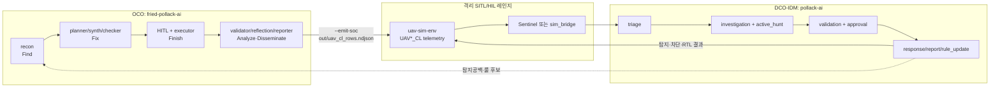

# 4. AI 에이전트 설계 및 구현

예선 안내서는 4장에서 "공격·방어 관련 AI 에이전트 아키텍처 및 구현 결과"를 요구한다. AI 에이전트 아키텍처에는 25점을 배정한다. 이 장은 네 가지 질문에 답한다. 두 에이전트가 무엇을 하는가(역할), 어떻게 협력하는가(구조), 무엇 위에서 도는가(기술 스택), 그래서 실제로 무엇을 산출했는가(구현 결과). 모델 성능의 우수성을 주장하는 것이 아니라, 임무 시스템에 편입 가능한 에이전트를 구현하였음을 제시하는 것이 목적이다.

시스템은 두 에이전트로 나뉜다. `fried-pollack-ai`는 공세적 사이버 작전(OCO)을 수행하는 레드팀 에이전트, `pollack-ai`는 방어적 사이버 작전(DCO-IDM)을 수행하는 AI SOC다. 한쪽은 무인기를 공격하고 다른 쪽은 그 공격을 탐지·대응한다. 둘은 격리된 SITL/HIL 레인지에서 UAV*_CL 텔레메트리 스키마를 공유하며 폐루프로 교전한다. 코드는 섞이지 않는다. 방어측은 공격 코드를 참조하지 않고, 공격이 남긴 로그만 소비한다.

## 4.1 미군 사이버 전력 구조와 작전 교리: 설계·코드로의 사상

설계의 출발점은 모델이 아니라 조직과 교리에 두었다. 군 조직에서 편제는 권한의 소재를 규정하고, 교리는 그 권한의 행사 순서를 규정한다. 이 두 기준이 코드의 저장소 경계, 그래프 순서, 승인 게이트, 로그 스키마로 반영되었다.

핵심 원칙은 다음과 같다. **AI는 판단을 돕고, 권한은 코드와 정책이 쥔다.** 즉 AI는 보좌 기능을 담당하고, 실행 권한은 사람과 코드에 귀속된다. LLM은 공격 계획 보조, 실행 결과 요약, 조사 근거 정리와 같이 불확실성을 줄이는 역할을 담당한다. 반면 교전권한, 물리 비가역 명령 승인, 심각도 하한, 정탐·오탐 판정, 대응 실행 여부처럼 임무 안전과 법적 책임이 걸린 결정은 결정론 모듈과 HITL 게이트가 처리한다. 이러한 경계가 없으면 에이전트의 처리 속도가 향상되더라도 군 임무 시스템에 편입하기 어렵다.

미군 기준을 채택한 것은 권위에 기대기 위함이 아니다. 미군은 사이버 공간을 작전 영역으로 다루고 그 경험을 교범과 조직 구조로 절차화해 왔다. 이미 검증된 절차 체계가 존재하므로 이를 새로 고안하지 않고 원용하였다. 이 보고서는 작전 논리를 미군 교리(JP·CJCSI·DoDD)에서, 사고대응·증거·통제 원칙을 NIST(SP 800-53·800-61·800-184·800-160v2·OSCAL·AI RMF)에서, 실행 자동화를 CNCF 클라우드 네이티브 스택과 LangGraph에서 가져왔다.

### 조직 분리가 첫 설계 결정이 된 이유

미 사이버사령부(USCYBERCOM)는 사이버 임무군(CMF)을 지휘한다. CMF는 임무 성격으로 갈린다. 국가임무팀(NMT)·사이버국가임무군(CNMF)·전투임무팀(CMT)은 표적에 효과를 투사하는 공세(OCO) 전력이고, 사이버보호팀(CPT)은 아군 네트워크를 헌팅·차단·강화하는 방어(DCO-IDM) 전력이다. 미군 또한 공세 전력과 방어 전력을 편제 단계에서 분리한다.

이 공수 분리를 그대로 첫 번째 설계 결정으로 삼았다. 공격 에이전트 `fried-pollack-ai`와 방어 에이전트 `pollack-ai`를 별도 저장소와 별도 런타임으로 나누고 방어측은 레드 코드를 import하지 않게 했다. 두 에이전트는 코드가 아니라 UAV*_CL 텔레메트리 스키마로만 만난다. 이 수준까지 분리한 이유는 다음과 같다. 하나의 프로그램이 공격 능력과 방어 판정을 동시에 보유하면, 공격자가 방어측의 판정 기준을 열람하여 회피에 최적화할 수 있다. 본 구조는 그러한 정보 유출 경로를 원천적으로 차단한다.

### 교리를 코드로 옮긴 매핑

교리와 조직은 명칭만 차용한 수사가 아니라 이 네 경계를 규정한 기준이다. 각 교리가 대응하는 코드 구현은 다음과 같다.

| 교리·조직 근거 | 코드 구현 |
|---|---|
| JP 3-12 · OCO/DCO/DODIN 분리 | 저장소 분리, UAV*_CL one-way 브릿지 |
| JP 3-60 · 표적화(CARVER·HPTL) | red `planner`, `targeting/carver.py`, `prioritize.py` |
| F3EAD 순환 | red 그래프 노드 순서(recon→…→reporter) |
| SROE·CDE·PID·JCEOI | `checker`, `broker`, `roe_gate.py`, `engagement/gate.py` |
| DoDD 3000.09 · 인간판단·중지 | HITL interrupt, 단발 토큰, out-of-band 검증 |
| CPT · Detect~Assess 순환 | blue 6-에이전트 SOC 그래프 |

F3EAD·CPT·DCO-IDM은 코드 식별자가 아니라 노드 순서이자 틀이다. 반면 CARVER·SROE·CDE·JCEOI·HITL 토큰·METT-TC·CPCON은 실제 모듈로 존재한다. 즉 일부는 절차 순서를 차용한 개념이고, 일부는 실제로 동작하는 코드다. 이 구분을 미리 밝혀 두는 것은 뒤에서 다룰 구현 결과를 과장 없이 해석하기 위해서다.

## 4.2 작전 대응: OCO ↔ DCO 폐루프

이 절은 두 에이전트가 어디서 돌고 어떻게 하나의 폐루프를 이루는지 다룬다. 먼저 에이전트를 올리는 클라우드 네이티브 운영면을 정하고, 그 위에서 OCO↔DCO 폐루프와 AI Engineering 다섯 계층, 그리고 사람이 상황을 보고 결심하는 참모 상황판까지 아키텍처를 쌓는다.

### 클라우드 네이티브 운영면

에이전트의 실행 환경 선정은 아키텍처의 첫 결정이다. 이를 클라우드 관리형 AI 서비스에 위임하지 않은 이유는 다음과 같다. UAV 작전이 실제로 수행되는 환경은 단일하지 않다. 후방의 퍼블릭 클라우드, 군 전용 프라이빗 클라우드, 통신이 끊기는 전술 엣지, 인터넷과 격리된 온프레미스 레인지가 섞인다. 미군의 획득 방향도 단일 사업자 고정이 아니라 다중 사업자(JWCC) 쪽이다. 특정 클라우드의 관리형 기능에 에이전트를 종속시키면 그 환경 밖으로 이식할 수 없고, 정작 무인기가 운용되는 격리망에서는 동작하지 않는다. 따라서 에이전트를 Kubernetes 위의 컨테이너 워크로드로 구현하였다. 동일 컨테이너를 AKS, 온프레미스, 통신이 단절된 레인지 등 환경에 관계없이 그대로 배포한다. Helm은 배포 절차를 코드로 고정하고, OpenTelemetry·Prometheus·Grafana는 에이전트가 무슨 판단을 했는지 사후 감사 가능하게 남기며, RBAC와 서비스 메시(Istio/mTLS)는 에이전트 간 호출을 최소권한으로 제한한다.

**kagent: 통제 문제를 기존 통제로 해결한다.** 핵심 난제는 에이전트의 실행이 아니라 통제이다. 사이버 효과를 트리거할 수 있는 AI 에이전트는 특권 워크로드다. 따라서 AI를 예외적 대상으로 취급하지 않고, 운영팀이 이미 신뢰하는 통제 체계 안에 일반 서버와 동일하게 편입하였다. kagent(CNCF Sandbox)는 에이전트와 세션을 CRD로 선언하므로, 배포는 GitOps 리뷰를 거치고 접근은 RBAC로 차단되며 admission control이 실행 전 검증한다. 동일한 인증과 검증 절차를 적용하는 것이다. 통제 범위는 여기서 한층 더 확장된다. `mcp_server.py`는 개별 킬체인 액션을 도구로 노출하지 않고 `run_engagement(...)` 하나만 노출한다. 액션 단위로 도구를 노출하면 LLM이 사실상 표적을 선정하게 된다. 노출 도구를 하나로 제한하면 공격 대상과 방식은 여전히 RoE/HITL/allowlist가 결정하고, LLM은 교전을 개시하고 그 결과를 판독하는 역할에 국한된다. LLM의 개입 범위를 축소하는 것이 목적이다.

**GitOps: 임무 시스템에서 수동 변경은 공격과 구별되지 않는다.** 방어 룰이나 NetworkPolicy가 Git 이력 없이 변경되면, 그 변경이 정당한 운영인지 침입자에 의한 것인지 사후에 판별할 수 없다. 따라서 Git을 배포의 정본 대장으로 삼았다. Argo CD는 클러스터의 실제 상태를 이 대장(Git)과 지속 대조해 어긋남(drift)을 탐지하므로, "누가 변경하였는가"가 추적 가능한 질문이 된다. 탐지룰·런북·에이전트 CRD·Helm values·RBAC가 손으로 바뀌면 대장에 없는 변경이라 OutOfSync로 떠 절차 위반으로 취급된다. 사람의 의도는 PR 이력에 남고, 클러스터는 승인된 상태로 수렴하며, 에이전트는 그 경계를 벗어날 수 없다. GitOps를 편의 기능이 아니라 보안 통제로 쓰는 이유다.

**Azure: 추상적 주장이 아니라 실제 SOC에 대한 검증.** 방어 능력을 말로만 주장하지 않으려면 구체적 SOC 환경에서 실행해야 한다. Microsoft Sentinel을 기준으로 삼은 것은 탐지(SIEM)·대응 자동화(SOAR)·조회 언어(KQL)·플레이북이 하나의 운영면으로 통합돼 있어, 탐지에서 대응까지가 개별 부품을 임의로 결합한 것이 아니라 단일 시스템이기 때문이다. Korea Central(Seoul)·Korea South(Busan) paired region 또한 국내 UAV 실증에서 명분이 아니라 요건에 해당한다. 텔레메트리가 국내에 머무는 데이터 주권과, 한 리전이 중단되어도 다른 리전으로 전환하는 재해 복구는 국방 데이터에서 선택 사항이 아니다. 다만 Azure에 종속시키지는 않았다. 구현 가치가 클라우드 교체 시에도 유지되어야 하므로, Sentinel 읽기 경로와 ARM 분석룰(`S1_GNSS_Spoofing.json`)을 기준 구현으로 두되 그 위는 Kubernetes·OpenTelemetry·GitOps 이식 계층으로 감쌌다. AWS의 GuardDuty·Security Hub·Security Lake로 바꾸더라도 이 계층은 그대로다.

**pollack-infra: 배포면을 코드로.** 이 Azure 기반은 수작업으로 구축하지 않는다. 별도 저장소 [`pollack-infra`](https://github.com/s1ns3nz0/pollack-infra)가 구독 스코프 Bicep IaC로 레인지 전체를 한 번에 provisioning한다. AKS 클러스터(레드 교전·SITL 심)·ACR·프라이빗 DNS·egress 방화벽·워크로드 아이덴티티(federated credentials)·Azure OpenAI 역할 할당·Log Analytics(Sentinel 백엔드)·텔레메트리 인제스트가 각각 모듈로 나뉜다. 에이전트 코드와 인프라 코드를 분리한 덕에 배포·검토·통제가 GitOps 경계 안에서 한 번의 배포로 재현된다.

### 두 에이전트의 단일 폐루프 구성

두 에이전트를 폐루프로 묶은 이유는 방어를 가정으로 평가하지 않기 위해서다. 공격 에이전트가 킬체인을 실행하면 UAV*_CL 텔레메트리가 남고, 방어 에이전트는 그 로그를 읽어 탐지·판정·대응한다. 방어가 막은 단계와 놓친 단계는 다음 교전의 입력이 된다. 이 반복이 이 장에서 말하는 지속 교전이다.

모델은 이 구조에서 중앙 지휘자가 아니다. LangGraph 상태머신, 정책 게이트, RAG, Sentinel/sim_bridge, GitOps 배포면 사이에 놓인, 언제든 교체 가능한 부품이다. 폐루프를 작전 관점으로 줄이면 다음과 같다.



여기서 중요한 점은 폐루프가 코드 파이프로 이어지지 않고 공유 스키마에서 닫힌다는 것이다. `fried-pollack-ai --emit-soc`는 실행 중 관측한 감사 이벤트를 UAV*_CL 행(`out/uav_cl_rows.ndjson`)과 참조용 SOC Alert(`out/soc_alert.json`)로 내보낸다. `pollack-ai`는 같은 스키마의 텔레메트리를 Azure Sentinel 또는 `sim_bridge`로 읽어 6-에이전트 파이프라인을 돈다. 방어측은 레드 코드를 import하지 않고 레드가 남긴 `*_CL` 행만 소비한다. 차단·거부된 액션은 애초에 UAV*_CL 행을 남기지 않으므로, 방어가 어느 단계에서 킬체인을 끊었는지가 로그의 있고 없음만으로 확인된다.

### AI Engineering 아키텍처: 다섯 계층

이 장의 AI Engineering 관점은 "모델을 붙인 자동화"가 아니라, 임무 절차를 타입이 정해진 상태머신으로 만들고 그 안에 LLM을 제한된 부품으로 배치하는 설계다. 중심은 모델이 아니라 상태, 도구, 정책, 증거, 배포 경계다. 각 계층은 하나의 안전 역할만 담당한다.

| 계층 | 목적 | 구현 요소 |
|---|---|---|
| Agent workflow | 교리 절차를 상태 전이로 고정 | LangGraph, `SOCState`, red/blue 그래프 빌더 |
| Tool boundary | LLM의 직접 위험행위 차단 | FastMCP, kagent, coarse-grained MCP, allowlist |
| Knowledge grounding | 근거 검색, 판정권은 불허 | RAGFlow, 로컬 GraphRAG, `RetrievedChunk` |
| Decision control | 안전·법적 결정을 모델 밖으로 | `SeverityEngine`, signal judge, HITL, CACAO/런북 |
| Evaluation & Ops | 재현성·관측성·배포 무결성 | golden fixture, OpenTelemetry, Argo CD drift |

LLM은 이 다섯 계층 어디에서도 최종 권한을 갖지 않는다. `core/llm.py`의 `LLMClient` 프로토콜 뒤에 있으며, 현재 구현은 Ollama qwen2.5(`OllamaLLMClient`)이고 Azure OpenAI(GPT-4o)는 같은 프로토콜을 구현하는 교체 지점으로 남겨 두었다. 모델을 바꿔도 상태·정책·게이트 경계는 그대로다. 이것이 "모델은 교체 가능한 부품"이라는 설계 문장의 실제 의미다.

### 작전 관측·지휘면: 참모 상황판

아키텍처의 마지막 계층은 사람이 보는 화면이다. "AI는 판단을 돕고 권한은 사람과 코드가 쥔다"는 원칙은, 지휘관이 실제로 상황을 보고 결심할 화면이 있어야 성립한다. `pollack-ai`의 `app/dashboard.py`(정적 자원 `app/dashboard_static/`)가 그 화면인 **사이버 작전 참모 상황판**을 제공한다.


이 상황판은 2.4~2.6절의 세 킬체인(A 제어권 탈취·B 영상 변조·C 데이터 유출)을 UAV ATT&CK 15전술 매트릭스 위에 라이브로 재생한다. 참모는 단일 화면에서 적의 진행 단계, 방어의 차단 지점, 요구되는 지휘관 결심 사항을 좌표로 확인한다. 화면이 제시하는 내용은 다음과 같다.

- **적 진행도**: 각 전술·기법 카드를 진행 중·예상 다음 수순·방어 공백(미구현)·헌팅 예정으로 색을 나눠, 킬체인이 매트릭스 위 어디까지 왔는지 표시한다. 붉은 밑줄이 방어 공백 전술이다.
- **지휘 상태**: 진행 중 적 행동 수, 최고 임무 영향(예: 제한적 임무 지속), 지휘관 결심 대기 건수, 결심 여유, CPCON 방호태세를 상단 카드로 고정한다.
- **결심 연결**: 자동 조치 가능/HITL 필요 여부가 시나리오별로 표시돼, 4.4절 `ApprovalAgent`의 사람 결심 지점을 실제 운용 인터페이스로 잇는다.

즉 폐루프의 공격·방어 진행도가 텍스트 로그가 아니라 전술판 좌표와 지휘 카드로 표시된다. 이 화면이 존재해야 AI가 신속히 판단하되 위험한 결심은 사람이 수행한다는 설계가 운용 현실에서 작동한다.

## 4.3 레드팀 AI 워크플로우 · fried-pollack-ai

레드팀 AI는 개별 공격을 자유형 대화로 처리하지 않고, 정해진 체크리스트 순서에 따라서만 진행한다. `redteam_core/graph/build.py`의 `_build_langgraph()`가 LangGraph 상태머신을 생성하고, 그 안에서 정해진 순서로만 진행한다. 이 순서는 미군 표적화 순환인 F3EAD(Find·Fix·Finish·Analyze·Disseminate)를 코드로 옮긴 결과다. LLM은 계획 보조와 요약에만 쓰이고, 라우팅·교전권한·성공 판정은 결정론 함수와 오라클이 맡는다.

```python
# redteam_core/graph/build.py - _build_langgraph() 노드 배선
g.add_edge(START, "recon"); g.add_edge("recon", "planner")     # Find
g.add_edge("planner", "synth"); g.add_edge("synth", "checker") # Fix
g.add_conditional_edges("checker", route_after_checker, {"ok": "broker", "violation": "reflection"})
g.add_conditional_edges("broker", route_to_hitl, {"needs_approval": "hitl", "auto": "executor"})
g.add_conditional_edges("hitl", route_after_hitl, {"approved": "executor", "denied": "reflection"})
g.add_edge("executor", "summarizer"); g.add_edge("summarizer", "validator")  # Finish
g.add_edge("validator", "reflection")                                        # Analyze
g.add_conditional_edges("reflection", route_after_reflection,
                        {"continue": "planner", "rescan": "recon", "stop": "reporter"})
g.add_edge("reporter", END)                                                  # Disseminate
```

**Find: 정찰과 자산 상태 적재.** 공격에 앞서 대상 환경을 파악한다. `recon`은 레인지 텔레메트리와 자산 상태를 타입이 정해진 사실로 적재한다. 여기서 AI는 공격을 시작하지 않고 공격 가능한 표면을 좁힌다. 기반은 JP 3-12의 사이버 3계층과 MITRE ATT&CK Reconnaissance다. RF/C2 링크는 물리 계층, MAVLink·텔레메트리 버스는 논리 계층, GCS 계정·토큰은 페르소나 계층으로 정리된다.

**Fix: 표적 선정과 명령 합성.** 표적 후보에 점수를 매겨 순위를 낸다. `planner`는 2장 시나리오 목표를 원자 액션 그래프로 바꾸고, 표적 우선순위를 JP 3-60의 CARVER로 산정한다. `targeting/carver.py`가 여섯 항목을 점수화하고 `targeting/prioritize.py`가 합계와 criticality로 표적 목록(HPTL)을 정렬한다. 이어 `synthesizer`가 추상 액션을 실제 명령으로 조립하고, `checker`가 sysid allowlist·구문·`think` 누출을 검사한다. 이 단계까지는 도구 실행 권한이 없으며, 계획 수립에 국한된다.

```python
# redteam_core/targeting/carver.py / prioritize.py
@dataclass(frozen=True)
class Carver:
    criticality: int; accessibility: int; recuperability: int
    vulnerability: int; effect: int; recognizability: int

def prioritize(targets):
    return sorted(targets, key=lambda t: (t.score(), t.carver.criticality), reverse=True)
```

**Finish 직전: 권한 게이트.** 실행 직전 교전 권한을 재검증한다. `broker`가 read/write 권한을 나누고, `route_to_hitl`이 실행 시점에 라이브 물리 상태를 다시 읽어 위험등급을 재분류한다. 되돌릴 수 없는 물리 명령이면 `hitl_gate_interrupt`가 LangGraph `interrupt()`로 그래프를 세우고 사람을 기다린다. 기반은 SROE·CDE·JCEOI·DoDD 3000.09다. LLM은 교전 가부를 판단하지 못하고, RoE 게이트가 허용(PERMITTED)·상급 결심(ESCALATE)·차단(BLOCKED)을 결정한다.

```python
# redteam_core/roe/roe_gate.py - 교전권한 판정(모델 밖 결정론)
if risk_tier in set(profile.get("pid_required_for", [])) and not target.get("pid"):
    unmet.append("PID 미충족: 적극식별 없음 (SROE)")
if unmet or not decon.ok:      verdict = RoeVerdict.BLOCKED
elif req > avail:              verdict = RoeVerdict.ESCALATE
else:                         verdict = RoeVerdict.PERMITTED
```

승인이 필요한 물리 비가역 명령은 일회용 승인 도장을 요구한다. `safety/hitl_gate.py`가 승인 시에만 단발·노드바인딩·만료 토큰을 발급하고, `engagement/gate.py`가 executor 경계에서 한 번만 소모한다. 일회 사용 후 소멸하며 일정 시간이 경과하면 만료된다. 승인 플래그의 재사용을 방지하는 코드 수준의 무력사용 통제다.

```python
# safety/hitl_gate.py / engagement/gate.py
if approved and node.risk_tier == "physical_irreversible":
    gate.issue_token(node.id, approver="operator", ttl_s=120.0)

def consume_token(self, node_id):
    t = self._tokens.get(node_id)
    if not t or t["used"] or time.time() > t["expires"]:
        return False
    t["used"] = True
    return True
```

**Finish: 실행과 요약.** `executor`는 승인된 단일 명령만 적용하고 ACK를 가린다(redaction). `summarizer`는 이미 수행된 원자 액션과 관측 결과를 사람이 읽을 형태로 정리한다. AI는 실행 결정을 내리지 않는다. 사람이 임무 의도와 RoE 상한을 주면 에이전트는 그 범위 안에서 수단만 고른다. `mission_command/commander.py`가 의도를 수단으로 분해하되, 권한 상한을 초과하는 목표는 자동으로 보류한다.

```python
# mission_command/commander.py - 의도→수단 분해 + RoE 상한 초과 보류
for eff in profile.desired_effects:
    for obj in _EFFECT_MEANS.get(eff, [eff]):
        if _OBJ_AUTHORITY.get(obj, 2) > profile.roe_ceiling:
            res.decisions.append(Decision(obj, "withheld_roe", "-", None, "권한 상한 초과"))
            continue
        r = adaptive_engage(obj)
```

**Analyze: 효과 검증.** 성공 여부는 LLM의 진술이 아니라 독립 관측 신호가 결정한다. `validator`는 시스템 밖에서 독립적으로 관측하는 오라클과 judge 앙상블로 공격 효과를 검증한다. `SignalJudge`가 최종 거부권(veto)을 쥐고, `ExperienceJudge`는 과거 경험을 조언으로, `LLMJudge`는 옵션 조언자로 붙는다. 최종 성공·실패는 LLM 설명이 아니라 오라클 신호가 정한다. 조언과 오라클이 엇갈리는 두 경우는 위험 신호로 표면화한다.

```python
# judge/ensemble.py - 오라클 veto 최종 + dissent 표면화
final = authoritative.verdict                       # 오라클이 최종
if any(j.verdict == SUCCESS for j in dissent) and final == FAIL:
    flag = "advisory_overclaim"    # 조언 성공·오라클 실패 → 환각 성공 방어
elif any(j.verdict == FAIL for j in dissent) and final == SUCCESS:
    flag = "covert_effect"         # 오라클 성공·조언 놓침 → 은밀 성공·탐지격차
```

`covert_effect`는 공격은 성공했지만 조언자 judge가 이를 포착하지 못한 경우다. 방어가 탐지하지 못한 은밀한 성공으로, 4.5절 탐지공백 환류의 입력이 된다.

**Disseminate: 리포트와 SOC 브릿지.** `reflection`이 성공·실패, 루프 반복, 새 단서를 보고 계속(planner)·재정찰(recon)·종료(reporter) 중 하나로 라우팅한다. 경험은 `learning/experience.py`에 위변조 방지용 SHA-256 서명 레코드로 남는다. `reporter`는 finding, 탐지격차, judge 결과, OPSEC 예산, learning을 묶고, `--emit-soc` 모드에서 UAV*_CL 행과 SOC Alert를 산출해 블루팀이 소비하게 한다. 공격이 남긴 관측이 곧 방어 룰·플레이북 평가의 입력이다.

**외부 연동.** `mcp_server.py`는 FastMCP 래퍼로 kagent가 호출하는 `run_engagement(profile, range_mode, hardened, emit_soc)` 하나만 노출한다. `/healthz`를 두고, `range_mode`가 `ALLOWED_RANGE_MODES`(기본 `container`) 밖이면 `ValueError`로 거부한다(모르면 일단 막는 fail-closed, HIL/live는 별도 인가 필요). `integrations/`의 외부 연결부는 자격·네트워크가 없으면 실제 도구 대신 결정론 dry-fallback으로 내려가고, 샌드박스를 통과할 때만 실제 도구가 열린다. 목적은 도구를 많이 붙이는 것이 아니라, 도구가 없어도 재현 가능한 Tier 0 경로를 유지하면서 도구가 붙을 때는 allowlist·hash·fail-closed 경계를 지키는 것이다.

## 4.4 블루팀 AI 워크플로우 · pollack-ai

블루팀 AI는 6-에이전트 SOC 워크플로우다. `agents/graph.py`의 `build_soc_graph()`가 `SOCState` 위에 LangGraph를 컴파일하고 정해진 순서로 진행한다. 방어 AI는 대응을 즉석에서 생성하지 않는다. 관측을 사건으로 통합하고, 해당 사건을 접수→조사→판정→결재→대응의 표준 절차에 따라 처리한다.

```
triage → investigation → [active_hunt?] → validation
validation ─(true_positive)→ [approval? if hitl] → response → report → END
validation ─(false_positive)→ rule_update → report → END
```

`active_hunt`는 Sentinel workspace가 있고 정책이 켜졌을 때만, `approval`은 `build_soc_graph(hitl=True)`에서만 삽입된다. 모든 노드는 `_timed()`로 감싸 처리시간을 계측하도록 계장돼 있어, 접수·대응 지연 같은 지표를 남길 수 있다. CPT의 Detect·Hunt·Clear·Enable Hardening·Assess가 이 그래프 안에서 실행된다.

```python
# agents/graph.py - build_soc_graph() 주요 배선
graph.set_entry_point("triage")
graph.add_edge("triage", "investigation")
if active_hunt is not None:
    graph.add_edge("investigation", "active_hunt")
    graph.add_edge("active_hunt", "validation")
else:
    graph.add_edge("investigation", "validation")
graph.add_conditional_edges("validation", route_after_validation,
                            {"true_positive": tp_target, "false_positive": "rule_update"})
graph.add_edge("response", "report"); graph.add_edge("rule_update", "report")
graph.add_edge("report", END)
```

**Detect: TriageAgent가 경보를 정책 등급으로 고정한다.** 접수 단계에서 `TriageAgent`는 `SeverityEngine`으로 심각도를 계산하고, `ActorReadGate`로 알려진 행위자 프로필을 읽으며, `MissionRiskAssessor`로 METT-TC 임무위험을 반영한다. LLM이 제안한 심각도가 정책 등급보다 낮으면 무시된다. 즉 LLM이 위험도를 낮게 평가하더라도 정책 하한 이하로는 하향되지 않는다. 기반은 DCO-IDM Detect, METT-TC, 그리고 OWASP LLM01(컨텍스트 조작으로 안전 결정을 낮추는 위험)이다.

```python
# agents/triage_agent.py - 정책 하한 + METT-TC 상승
level, rationale = self._engine.compute(alert)
suggested = alert.llm_suggested_severity
if suggested is not None and _PRIORITY[suggested] > _PRIORITY[level]:
    flags.append(f"제안등급({suggested}) < 정책등급({level}) → 무시")
mr = self._mission_risk.assess(alert)
if sum(mr.factors.get(f, 0) for f in cfg.priority_delta_factors) >= cfg.priority_delta_min:
    priority = max(1, priority - cfg.priority_delta_cap)
```

**Hunt: InvestigationAgent가 증거를 확장한다.** 조사 단계에서 `InvestigationAgent`는 알림 제목·시나리오 ID·신호를 검색어로 만들어 RAG로 유사사례를 찾고, 외부 위협정보(TI)·샌드박스·취약점·GNSS 재밍·항적 컨텍스트를 붙인다. 다만 LLM은 요약에만 사용한다. `PromptInjectionGuard`가 신뢰할 수 없는 외부 텍스트를 격리하고, `IocEgressFilter`가 외부 조회 전에 지표(IOC)를 정제한다. 조사는 광범위하게 수행하되 정탐 판정권은 부여하지 않는다. 기반은 CPT Hunt, ACH 경쟁가설분석, MITRE ATLAS AML.T0051이다.

RAG는 이 단계의 근거 확장 계층에 해당한다. 사건과 유사한 과거 사례 및 문서를 검색해 부가하는 참고자료 검색기다. 구조는 두 겹이다. `RagflowRetrievalTool`은 로컬 RAGFlow `/api/v1/retrieval`을 LangChain `BaseTool`로 감싼 평면 검색으로, UAV 보안 사례·ATT&CK for ICS·IEC 62443·데이터셋 실측을 찾고 출처를 `kb/<문서명>`으로 정규화한다. `GraphRetriever`는 `data/mitre_attack_graph.yaml`을 읽는 결정론 그래프 검색으로, 시나리오·기법 노드에 신호·자산·기법 ID를 매칭하고 이웃한 전술·룰·플레이북·워치리스트까지 펼친다. 두 검색기는 같은 `RetrievedChunk` 계약을 반환해 `CompositeRetriever`로 합쳐진다.

```python
# agents/graph.py - RAG 기본 배선
pieces = []
if settings.ragflow_api_token.get_secret_value() and settings.ragflow_dataset_id:
    pieces.append(RagflowRetrievalTool(settings=settings))
if settings.graph_rag_enabled and _GRAPH_DATA.is_file():
    pieces.append(GraphRetriever.from_yaml(_GRAPH_DATA))
return CompositeRetriever(pieces) if len(pieces) > 1 else (pieces[0] if pieces else None)
```

RAG에는 판정권을 부여하지 않았다. RAGFlow 검색이 실패하면 빈 컨텍스트로 강등되고, GraphRAG는 외부 서비스 없이 YAML만 읽어 오프라인에서도 동작한다. 심각도는 `SeverityEngine`, 정탐·오탐은 `ValidationAgent`, 대응 선택은 CACAO/런북 계약이 결정한다. 참고자료는 근거 제공에 한정되며 결정에는 관여하지 않는다.

**Hunt 확장: ActiveHuntAgent.** 필요 시에만 삽입되는 부가 조사 에이전트다. active hunt가 활성화되고 Sentinel workspace가 있으면 `ActiveHuntAgent`가 그래프에 삽입된다. `ActiveHuntPlanner`가 헌팅 정책과 커버리지 매트릭스로 읽기 전용 KQL을 만들고, `AzureMonitorSentinelQueryClient`가 Sentinel에서 증거를 가져온다. 방호태세(CPCON)가 높을수록 헌팅 강도가 커진다. 대응 실행이 아니라 증거 확장만 하므로 DCO-IDM Hunt와 CPCON 원칙에 맞는다.

**Assess: ValidationAgent가 정탐·오탐을 판정한다.** 판정 단계에서 `ValidationAgent`는 단일 결정론 judge 또는 점수 기반 judge 앙상블을 실행한다. 앙상블에서는 `SignalJudge`·`LlmJudge`·`ExperienceJudge`가 점수를 내지만, 신호 기반 거부권(signal hard-veto)이 우선한다. 신호 기반 판정이 부정이면, LLM의 설명이 아무리 설득력 있더라도 정탐으로 확정되지 않는다.

```python
# agents/validation_agent.py - ensemble 판정과 guardrail 전파
scores = await asyncio.gather(*(j.ascore(state) for j in self._ensemble_judges))
result = ensemble(list(scores), self._weights, self._threshold)
update = {"verdict": result.verdict, "ensemble": result, "trace": ["validation"]}
if [s.guardrail for s in scores if s.guardrail]:
    update["guardrail_flags"] = [s.guardrail for s in scores if s.guardrail]
```

**승인 상승: ApprovalAgent.** 결재 단계에서 `hitl=True`일 때 정탐은 `ApprovalAgent`를 거친다. severity가 HIGH인지, 임무위험이 임계값 이상인지, CACAO가 보수적 분기를 요구하는지, 런북이 승인을 요구하는지 확인하고, 하나라도 해당하면 LangGraph interrupt로 사람의 결심을 요구한다. 고위험 사건은 사람의 결재 없이는 자동대응이 실행되지 않는다. 기반은 OASIS CACAO 2.0 임무 게이트, NIST SP 800-61 의사결정 통제다.

```python
# agents/approval_agent.py - HITL 강제 조건
force_high = severity == Severity.HIGH
force_mission = mission_risk is not None and mission_risk.score >= self._hitl_force_threshold
if not (force_high or force_mission or self._cacao_forces_hitl(state) or self._runbook_forces_hitl(state)):
    return {"approval": ApprovalResult(required=False, approved=True, note="자동대응")}
```

**Clear: ResponseAgent가 사전 정의 대응을 표면화한다.** 정탐이면 `ResponseAgent`가 실행된다. `select_playbook`으로 전술에 맞는 CACAO 플레이북을 고르고, `resolve_playbook`으로 임무위험에 따른 분기를 정한다. 이어 런북을 찾고, 임무 지속성과 단계적 성능저하(graceful degradation)를 평가해 대응 권고를 생성한다. 다만 액추에이터를 직접 작동시키지는 않으며, 사전 정의된 대응안을 선정해 상신할 뿐이다. 기반은 OASIS CACAO 2.0, NIST SP 800-61·800-53·800-184·800-160v2다.

```python
# agents/response_agent.py - 전술→CACAO→런북→임무연속성
cpb = select_playbook(self._scenario_tactic.get(alert.scenario_id, ""), self._playbooks)
if cpb is not None:
    plan = resolve_playbook(cpb, mission_risk)
    cacao_id, cacao_steps, mission_branch = plan.playbook_id, plan.steps, plan.mission_branch
runbook, runbook_status = self._resolve_runbook(alert, cacao_id)
mission_continuity = self._assess_mission_continuity(state)
```

**Enable Hardening: RuleUpdateAgent.** 오탐이면 `RuleUpdateAgent`로 이행한다. 룰 본문(KQL)은 수정하지 않고 워치리스트 값만 조정한다. 보정은 화이트리스트·예외·임계값 조정으로만 제한되고, `RulePublisher`가 기존 룰을 훼손하지 않는지 검증한 뒤 GitHub PR을 생성한다. 룰 전체를 개정하지 않고 최소한으로만 변경하는 탐지공학의 least-change 원칙이다.

**Assess: ReportAgent.** 정탐·오탐 두 경로 모두 최종적으로 `ReportAgent`로 수렴한다. Diamond, Kill Web, IoA graph, campaign, COA, recovery, STRIDE, SBOM/AIBOM, 임무위험, active hunt 결과를 읽기 전용으로 모아 최종 리포트와 OSCAL 증거를 만든다. 기반은 NIST OSCAL, RMF/POA&M, CISA ZTMM, AI RMF다. 이 단계가 3장의 탐지룰·런북·플레이북 계약과 실제 SOC 실행 결과를 잇는다.

**그래프 밖 지속 학습.** 실시간 처리 경로 밖에는 백그라운드 워커 세 개가 있다. `ThreatLandscapeAgent`가 ATT&CK/ATLAS/EMB3D와 CISA KEV 피드를 갱신하고, `AutoKqlRuleAgent`가 신규 기법을 KQL 초안 PR로 바꾸며, `OutcomeProbeAgent`가 관측 결과를 경험·행위자·플레이북 점수 쓰기 게이트로 되먹인다. 기반은 NIST SP 800-150 위협정보 공유와 지속 교전이다.

**과거 오탐 기반 반복 오탐 억제 학습.** 방어 AI는 동일 오탐의 반복을 방지하도록 결정론적 경험 저장소로 정밀도를 보정한다. 정탐·오탐이 확정되면 `OutcomeProbeAgent`가 그 결과를 `core/experience.py`의 서명된(SHA-256) 경험 저장소에 content-hash 지문으로 적재한다(`MemoryWriteGate`). 같은 맥락의 알림이 다시 오면 `ExperienceJudge`가 과거 확정 오탐과의 대응(suppression corroboration)을 점수화해, 신호·룰·근거가 다 있어 결정론 judge가 정탐과 구분하지 못하던 맥락 의존 오탐을 억제한다. 핵심은 재현율을 유지하는 것이다. 다른 신호를 가진 실제 공격은 다음 회차에도 정탐으로 유지된다. 억제 학습에는 오염 방지 가드도 존재한다. 신뢰할 수 없는 입력이 억제를 주입하려 하면 `REJECTED_UNTRUSTED_SUPPRESSION`으로 거부되어, 공격자가 특정 공격을 오탐으로 학습시켜 실제 공격을 무력화하는 경로를 차단한다. 효과는 `benchmarks/run_fp_recurrence.py`가 2회차(메모리 없음 → 있음)로 FP-재발률과 Rule Effectiveness(재오탐 감소율)를 결정론으로 계량한다.

**적대적 자기검증.** RAG와 LLM의 출력을 무비판적으로 신뢰하지 않기 위한 안전장치다. `core/ai_redteam.py`가 `ai-redteam-scenarios.yaml` 위에서 프롬프트 인젝션과 RAG 오염을 반복 검증하고, `PromptInjectionGuard`가 정상 SOC 텍스트와 공격성 텍스트를 구분한다. RAGAS는 InvestigationAgent 요약이 근거에 충실한지(faithfulness 등)를 선택적으로 채점한다. PyRIT는 완전 연동이 아니라 벤치마크 골격 상태다. 어느 경우든 판정권은 정책 엔진·signal judge·CACAO/런북 계약에 남는다.

**sim_bridge.** Azure Sentinel 없이도 폐루프를 완성하는 직접 연결 경로다. `sim_bridge/`는 `uav-sim-env`(ArduPilot SITL + Gazebo + QGroundControl)의 텔레메트리 NDJSON을 6-에이전트 SOC로 잇는다. `models.TelemetryRecord`가 탭 키를 매핑하고, `detector.GpsSpoofDetector`가 S1 분석룰의 런타임 근사(EKF 이상 + GPS 품질 상관)로 알림을 만들며, `bridge.SimBridge`가 `build_soc_graph`를 돌리고, `actuator.MavlinkActuator`가 SOC의 정탐/복귀 결정을 MAVLink `RETURN_TO_LAUNCH`(자동 귀환)로 되먹여 폐루프를 닫는다.

## 4.5 폐루프 교전과 위협 정보 기반 방어

방어의 유효성은 문서상의 주장이 아니라 실증을 통해 확인한다. 실제 공격을 인가해 방어가 차단한 지점과 놓친 지점을 직접 계측한다. 교전 절차는 네 단계다.

1. `fried-pollack-ai`가 2장 시나리오를 SITL 레인지에서 실행하고 `--emit-soc`로 UAV*_CL 행과 참조 SOC Alert를 내보낸다.
2. `pollack-ai`가 같은 스키마의 텔레메트리를 Sentinel·`sim_bridge`로 읽어 6-에이전트 파이프라인을 돌리고, 각 킬체인 단계의 탐지·판정 여부를 산출한다.
3. 방어가 차단한 단계와 놓친 단계가 탐지공백 리포트로 산출된다. B 시나리오의 텔레메트리 오염(T1565.001)과 같이 룰이 부재한 영역이 이 단계에서 드러난다.
4. 갱신 워커(`OutcomeProbeAgent`·`AutoKqlRuleAgent`)가 그 공백을 방어 배포 우선순위로 환산하고, 룰을 배포한 뒤 다시 교전해 개선을 확인한다.

이 반복이 지속 교전이다. 방어는 문서상 가정이 아니라 실제 공격 행위로 검증되고, 공격은 방어가 강화된 영역을 회피해 다음 경로를 탐색한다. 미군의 전방 방어(defend forward)가 적을 근원에서 교전하는 것과 마찬가지로, 레드팀 에이전트는 방어 배포에 앞서 공백을 선제적으로 식별한다. `run.py --hardened`가 같은 시나리오를 취약·하드닝 두 인스턴스에 각각 돌려 만드는 PoV 페어가 이 검증의 실증 단위다.

판정에 사용하는 용어와 절차는 공식 표준에서 채택하되, 실시간 판정 자체는 결정론 엔진이 수행한다. 결정은 결정론 엔진이, 근거는 표준이 담당한다. 이 이중 원칙이 방어 대응을 성능 평가와 감사 양쪽에서 방어 가능하게 만든다. 이렇게 드러난 탐지공백의 계량과 갱신 우선순위는 4.6절의 SOC 탐지 커버리지 KPI 대시보드(미커버·계획 기법)로 이어진다.

## 4.6 구현 결과 및 검증

### 공격 에이전트 실증

`fried-pollack-ai`는 Python 모듈 197개, 원자 액션 22개로 무기고 기법 23종을 전부 커버하고, 그중 22종을 런타임 검증한다(커버 23/23=100%, 런타임검증 22/23≈95.7%, AML.T0020은 스테이징 단계). 벤치마크는 8개 그룹을 취약·하드닝 두 인스턴스로 돌려 16개 시나리오·8개 PoV 페어를 구성하고, `fried-pollack-ai` 테스트 616건이 통과한다. 수치는 아래 표와 같다.

| 항목 | 값 |
|---|---|
| Python 모듈 | 197 |
| 원자 액션 | 22 |
| 무기고 커버 | 23/23=100% (런타임검증 22/23, 95.7%) |
| 벤치마크 그룹 | 8 (A4·S1·M1·M2·R1·E1·I1·L1) |
| 시나리오 · PoV 페어 | 16 · 8 |
| 통과 테스트 | 616 |

```bash
python run.py --emit-soc     # 킬체인 실행 + UAV*_CL·SOC Alert 산출
python run.py --hardened     # PoV 페어: 취약 성공 / 하드닝 거부 비교
```

`--hardened`는 하드닝 인스턴스에서 같은 공격을 서명(MAVLink2)·견고모델·망분리·링크암호화로 거부해 위조 ACK만 돌려주고, 오라클이 진위를 판정해 PoV 페어를 구성한다. 동일 공격이 무방비 기체에서는 성공하고 방비된 기체에서는 차단됨을 나란히 제시한다. 이 대조가 공격·방어 연결의 실증이다.

### 회귀 게이트

머지 이전에 아래 G1~G4를 모두 통과해야 하며, 하나라도 충족하지 못하면 머지가 차단된다.

| 게이트 | 요구 조건 |
|---|---|
| G1 | 물리안전위반 0 |
| G2 | 무회귀(기존 통과 유지) |
| G3 | PoV 페어 일관성 |
| G4 | 취약 인스턴스 공격성공률 ≥ 1.0 |

### 방어 에이전트 실증

방어의 실증은 성능 수치가 아니라 결정론적 정합성과 구현 근거로 제시한다. 탐지율 수치가 아니라, 배포된 룰과 실행 코드의 결정론적 일치, 그리고 각 기능이 실제 코드와 테스트로 존재함이 방어측이 제시하는 증거다. `pollack-ai`는 6-에이전트 SOC 그래프와 3개 주기 워커로 DCO-IDM 순환을 자동화하고, 주요 컴포넌트는 로직과 단위 테스트까지 구현돼 있다. 영역별 구현 근거는 다음과 같다(LoC · 테스트 수).

| 영역 | 핵심 컴포넌트 (LoC · 테스트) |
|---|---|
| SOC 파이프라인 | investigation 725 · report 514 · response 315 LoC · SeverityEngine 239(테스트 90파일 참조) |
| 분석 엔진 | Hypothesis 372/32 · Correlation 297/17 · IoA graph 347/4 · KillWeb 168/11 · Diamond·Causal·Dynamics |
| 대응·복구 | CACAO 490 LoC(16 플레이북·143 스텝) · Runbook 195 LoC(131 런북) · Engage 195/17 · Honeypot 157/17 · COA 201/6 |
| 지휘 결심우위 | Intent 158/18 · OODA 121/14 · Commander 112/12 · BLUF Brief 172/15 |
| 위협인텔·공급망 | STIX export 288/28 · AIBOM 303/30 · SBOM·Malware·TI·Vuln 162·149·655·301 LoC |
| AI 자기방어 | Prompt injection guard 191/10(ATLAS AML.T0051) · Releasability 222/18 · Egress 141/18 · Zero-trust·AI redteam |
| 실 탐지(런타임) | GpsSpoofDetector(S1) 305 LoC, EKF 3σ + 절대 게이트 실 신호처리 |

이 컴포넌트들은 로직과 단위 테스트까지 구현·통과한 상태다. 남은 약 10%는 코드가 아니라 Azure 환경에서만 실체화되는 런타임 배선이다. LLM 요약은 현재 Ollama(로컬 qwen2.5)로 실연동되고 결정론 폴백을 갖추며, 프로덕션 Azure OpenAI(GPT-4o) 교체가 남았다. 3 주기 워커는 배선·테스트를 마쳤으나 실 스케줄러(AKS CronJob) 기동이, Sentinel/Azure Monitor 라이브 경로도 실 연결이 남았다. 이 부분을 본문에 담지 않은 이유는 Azure 실 구독에 아직 배포하지 않았기 때문이다. 배포 자체는 별도 저장소 `pollack-infra`의 구독 스코프 Bicep IaC로 코드화돼 있어, 실 구독에 apply하면 AKS·Azure OpenAI·Log Analytics(Sentinel 백엔드)가 한 번에 선다. 로직·계약·테스트는 오프라인 Tier 0에서 재현된다.

탐지 룰 라이브러리는 `sentinel/rule_manifest.json`으로 관리하는 165룰(`dah-sentinel-content`)이고, 그중 실 신호처리 깊이를 갖춘 것은 네이티브 4 + 프록시 6이다. `pollack-ai`에 직접 배포된 Analytic Rule은 `S1_GNSS_Spoofing.json`(EKF 3σ + 절대 게이트, `GNSS_Exception_List` 억제)으로, sim_bridge의 `GpsSpoofDetector`와 짝을 이루는 런타임 실 탐지기다.

대응층은 3.2절의 사전 정의 계약(`cacao-playbooks.yaml`·`runbooks.yaml`·`benchmarks/eval_scenarios/`·`commander-intent.yaml`)을 pydantic strict·교차검증기·회귀 테스트(`test_golden_fixture_response_trace.py`)로 고정한다. 검증 방식 자체가 증거에 해당한다. 골든 픽스처가 실제 프로덕션 배선을 재실행해 대조하므로, 탐지→플레이북→런북 연쇄가 배포된 룰과 불일치하는 즉시 테스트가 실패한다.

### SOC 탐지 커버리지 KPI 대시보드

`pollack-ai`의 `tools/coverage.py`(+ `core/dashboard.py`)가 `data/attack_coverage.yaml`과 `sentinel/rule_manifest.json`(실 165룰, `dah-sentinel-content`)을 읽어 **SOC 탐지 커버리지 KPI 대시보드**를 무의존·결정론 정적 HTML로 만든다. pollack-ai 자체 데이터 산출이다.


이 대시보드는 방어 룰의 **폭(breadth)과 깊이(depth)를 분리**해 보여준다.

- **전술 커버리지 93.3%**: ATT&CK 15전술 중 14전술에 탐지룰을 보유한다.
- **기법 커버리지 80.0%**: 방어 커버리지 매핑표(`attack_coverage.yaml`, Enterprise+ICS 투영) 110개 기법 슬롯 중 88개에 룰이 매핑된다(대응가능 82.2% = 자원개발 3개를 pre-compromise 범위 밖으로 뺀 88/107). 이 110은 방어측이 실제 매핑한 커버리지 모수로, 2.3절 공격 전술판 116기법(레드가 실행 가능한 전체 유니버스)의 부분집합이다. 방어가 공격보다 작은 이 차이가 아래의 커버리지 갭(미커버 15·성숙도 3.6%)이다.
- **탐지 룰 165개**: `dah-sentinel-content` 기반 Sentinel Analytic Rule 라이브러리.
- **성숙도(품질보정) 3.6%**: 룰 존재(폭)와 별개로, 실제 정밀 탐지 깊이를 가진 것은 네이티브 4 + 프록시 6뿐이다.

방어 룰의 폭은 넓으나(88기법·165룰) 배포 성숙도는 낮다(depth 3.6%). 이 breadth↔depth 격차가 현재 상태를 있는 그대로 반영한다. 커버리지 분해는 커버 88 · 계획 7 · 미커버 15로 나뉘고, 전술별로 Reconnaissance·InitialAccess·Impact 등은 전량 커버, Collection·CommandAndControl·InhibitResponseFunction 등은 아직 일부만 커버된다. 공격 아키타입별(사전침해·수동수집·암호화 C2 등) 커버 기법 수도 함께 낸다.

이 대시보드가 과장된 자평이 아닌 근거는 성숙도 3.6%를 은폐하지 않는다는 점이다. 넓은 룰 커버리지 위에서 실 배포 깊이를 향상시키고, 미커버 15기법·계획 7기법을 배포로 완결하는 것이 5.3절 향후 계획의 우선순위다. 결정론·무의존 렌더라 같은 입력에 같은 화면이 나온다. 운영 배포면에서는 Grafana 대시보드(`ai-soc`·`gates`·`dora`·`oscal`)가 OpenTelemetry 지표를 상시 관측면으로 잇는다.

### 정직성 가드

보고서 수치는 임의로 부풀릴 수 없도록 검증 파이프라인에 고정하였다. 문서 수치는 수기로 기재하지 않고 커밋된 산출물에서 재산출한다. `benchmarks/run_kpi.py`가 KPI를 계량하고, `benchmarks/check_gates.py`가 `benchmarks/results/*.json`을 임계와 대조해 미달 시 CI/CD를 차단하며, "광고한 기능 = 실제 배선"은 `tests/__tests__/test_*_wiring.py` 배선 테스트군이 확인한다. CI(`ci.yml`)는 black·ruff·mypy·pytest·CodeQL·Dependency Review를, 비밀 커밋은 pre-commit gitleaks를 차단 조건으로 건다. 목표 스택과 현재 구현을 구분해 표기한 것도 같은 원칙이다. 재현되지 않는 능력은 능력으로 계상하지 않는다. Tier 0 경로는 외부 의존 없이 표준 라이브러리만으로 즉시 재현된다.

### 입증 자료

공격 에이전트는 [github.com/s1ns3nz0/fried-pollack-ai](https://github.com/s1ns3nz0/fried-pollack-ai), 방어 에이전트는 [github.com/s1ns3nz0/pollack-ai](https://github.com/s1ns3nz0/pollack-ai), 배포 인프라(IaC)는 [github.com/s1ns3nz0/pollack-infra](https://github.com/s1ns3nz0/pollack-infra)에 공개돼 있다. 세 저장소의 실행 로그와 PoV 페어 산출물이 2~3장 설계의 근거다.
